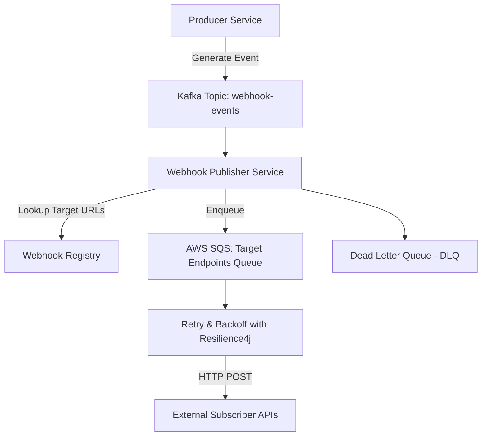

Webhooks are a critical integration pattern for modern SaaS platforms. They allow us to notify downstream services and partners in near real-time whenever important business events occur – enabling everything from order updates and payment confirmations to security alerts and workflow automation. Designing a reliable, scalable webhook publisher is far from trivial—especially when you need to guarantee ordering, retries, and throughput.

This post focuses specifically on the design and implementation of a *scalable webhook delivery system*. It assumes events are already being produced; webhook security, transformation, and filtering will be addressed in separate posts.

We'll walk through how we approached this challenge and share how we scaled our design to handle 5,000+ events per second in FIFO order without sacrificing delivery reliability.

## Challenges with Webhook Delivery

At first glance, sending a webhook looks simple:

1.  Capture an event
2.  Transform it into a payload
3.  POST it to a configured endpoint

But real-world complexity quickly creeps in:

-   **Unreliable endpoints:** Targets may be slow, down, or return errors.
-   **Retry semantics:** How many times should we retry? With what backoff?
-   **Ordering guarantees:** Certain events must be delivered in the exact order they occurred.
-   **Scalability:** Handling spikes of tens of thousands of events without introducing bottlenecks.
-   **Multi-endpoint delivery:** Same event may need to go to multiple destinations.
-   **Webhook transformations:** How do we transform event data to the format that is expected by the subscribers?
-   **Security and authentication:** How do we ensure that a given request is valid and secure and not a malicious one?
-   **Monitoring and alerting**: How do we monitor, alert, and quickly take action when there is an outage with webhook delivery?

We wanted a design that handled all of these gracefully with a goal of 99.99% delivery success rate, and we used automated alerting when we breached the error budget.

## Key Design Goals

-   **FIFO Guarantees**: Deliver events in the order they were produced to prevent race conditions and ensure data consistency for consumers.
-   **Retry & Backoff**: Automatic retries with exponential backoff to handle transient errors, powered by Spring Retry / Resilience4j with a maximum of 5 retry attempts.
-   **Multi-endpoint support**: Ability to fan out events to multiple subscriber endpoints.
-   **High Throughput**: 5K+ messages per second queued while ensuring delivery reliability.
-   **Low Latency**: sub-500ms latency for 90th percentile to ensure that the consumers quickly get alerted of new events.
-   **Observability**: Metrics, logging, and dead-letter queues (DLQ) for failed deliveries, as well as easy access to logs for quick debugging.

## The Architecture

Here’s a high-level breakdown of the architecture, built with Spring Boot, Kafka, AWS SQS, and Resilience4j:



### 1. Event Publisher (Producer)

Business services publish domain events (e.g., subscription created, order shipped) to a Kafka topic (`webhook-events`). Events conform to a well-defined Avro schema stored in a schema registry and producers generate a unique idempotency key for each event to prevent duplicates.
Here's an example of how the events are configured with properties

```yaml
spring.kafka:
    producer:
      key-serializer: org.apache.kafka.common.serialization.StringSerializer
      value-serializer: io.confluent.kafka.serializers.KafkaAvroSerializer
    properties:
      schema.registry.url: http://localhost:8081
      idempotence: true
```

### 2. Webhook Publisher Service (Consumer)

The `Webhook Publisher Service` consumes events from the `webhook-events` Kafka topic. It queries a webhook registry stored in MySQL to retrieve target URLs and configurations.
It is also configured to consume events in batches to amortize database lookup costs:

```yaml
spring.kafka.listener.ack-mode: BATCH
spring.kafka.listener.concurrency: 3
spring.kafka.consumer.max-poll-records: 500
```

### 3. AWS SQS: Target Endpoints Queue

Messages are enqueued onto AWS SQS using priority queues. AWS SQS offers fine-grained control over message routing and prioritization, which is ideal for processing various levels of webhook messages. The queue is sized to handle X hours of backlog during peak periods:

```java
@Bean
Queue firstPriority() {
    return new Queue("FirstPriorityQueue", true);
}

@Bean
Queue secondPriority() {
    return new Queue("SecondPriorityQueue", true);
}

@Bean
public MessageConverter jsonMessageConverter() {
    return new Jackson2JsonMessageConverter();
}

@Bean
SqsTemplate template(ConnectionFactory connectionFactory) {
    SqsTemplate rabbitTemplate = new SqsTemplate(connectionFactory);
    rabbitTemplate.setMessageConverter(jsonMessageConverter());
    return rabbitTemplate;
}
```

### 4. Retry & Backoff with Resilience4j

The webhook delivery is wrapped with Resilience4j's Retry module with exponential backoff. This provides resilience when external services are temporarily unavailable. If the circuit breaker opens, events are temporarily diverted to the DLQ.
Here’s a snippet of a Resilience4j configuration example:

```yaml
resilience4j.retry:
  configs:
    default:
      maxAttempts: 5
      waitDuration: 500ms
      enableExponentialBackoff: true
      exponentialBackoffMultiplier: 2
  instances:
    webhookRetry:
      baseConfig: default
```

### 5. Security

All webhook communication occurs over HTTPS with TLS 1.3. Subscribers can verify the origin of webhooks using HMAC signatures. Here is a snippet of how the signature is computed:


```java
public String calculateHMAC(String data, String secretKey) {
    try {
        SecretKeySpec secretKeySpec = new SecretKeySpec(secretKey.getBytes(), "HmacSHA256");
        Mac mac = Mac.getInstance("HmacSHA256");
        mac.init(secretKeySpec);
        byte[] hmacBytes = mac.doFinal(data.getBytes(StandardCharsets.UTF_8));

        // Convert to hexadecimal representation
        StringBuilder sb = new StringBuilder(hmacBytes.length * 2);
        for (byte b : hmacBytes) {
            sb.append(String.format("%02x", b));
        }
        return sb.toString();

    } catch (NoSuchAlgorithmException | InvalidKeyException e) {
        throw new IllegalArgumentException("Error calculating HMAC", e);
    }
}
```

> API keys are rotated regularly, and access is controlled via IAM roles.

### 6. Dead Letter Queue (DLQ)

Failed events are serialized to JSON and stored in an S3 bucket. A separate process can then be spun up to re-process these failed messages.
We monitor the DLQ and trigger alerts if the failure rate exceeds a threshold. Here is an example of a DLQ configuration:

```yaml
spring.cloud.stream.bindings.dlqSink-in-0.destination: dlqTopic
spring.cloud.stream.kafka.binder.dlqPartitions: 1
spring.cloud.stream.kafka.binder.dlqTtl: 3600000
```

### 7. Scaling Considerations

The `Webhook Publisher Service` is stateless and can be scaled horizontally by adding more instances behind a load balancer.
We implement rate limiting per subscriber to prevent overwhelming external APIs and Kafka Streams provides backpressure mechanisms to slow down consumption if downstream systems are overloaded.
We also cache webhook configurations to reduce database load, and we can implement connection pools to optimize database access.
All said and done, here is the diagram of the high level design:

## Event Ordering

Ensuring that the webhook deliveries are completed in order is a very important design aspect of this system. Kafka guarantees ordering within a partition, so we can configure the producer to deliver all events for a given subscriber to the same partition.
This can, however, reduce throughput. If we are looking for higher throughput, subscribers can opt out of ordering guarantees where appropriate. This is a classic trade-off of distributed architectures -- ordering is expensive.

## Monitoring & Observability
The system must be correctly monitored to be effective. To that end, here are some of the metrics we are tracking for the webhook delivery service:
- Consumption lag
- Delivery success rate
- Retry counts
- DLQ size
- Service latency

Here are some additional recommendations to ensure high quality of service:
- Using the metrics above, set up alerting policies.
- Instrument the code with Open Telemetry API to provide distributed tracing data.
- Visualize these metrics and traces in Grafana dashboards.

## Why using AWS SQS in addition to Kafka in this architecture?

AWS SQS offers a lot of features that are not available in Kafka. For example, it supports priority queues, which are useful for handling high-priority events.

### Why Not Just Kafka Consumers?

If the Webhook Publisher Service consumed directly from Kafka and then made HTTP calls, you'd face challenges:
- **Retry Complexity:** Implementing reliable retries with exponential backoff becomes more complex within a Kafka consumer. You'd need to manage retry state, delays, and potentially re-enqueue messages back into Kafka (which can affect ordering).
- **Rate Limiting:** Enforcing per-subscriber rate limits directly in the consumer is difficult. You'd need to track usage per subscriber and potentially pause consumption, leading to backpressure on the Kafka topic.
- **Idempotency:** While the producer might generate idempotency keys, the consumer still needs a mechanism to handle duplicate deliveries (e.g., store processed event IDs).
- **Fanout/Multi-Endpoint Delivery:** If a single event needs to be delivered to _multiple_ subscribers, the consumer would need to manage the delivery to each one. This adds complexity and can impact the consumer's throughput.
- **Queue Management:** Managing a "queue" of deliveries and guaranteeing its size requires manual implementations
- **Priority Queuing**: The ability to prioritize certain webhooks vs. others is not easily implemented
- **Load Balancing**: Managing consumers and load balancing with these requirements is difficult

### How AWS SQS Helps

Adding AWS SQS as an intermediary provides these benefits:
- **Decoupling:** Decouples the Kafka consumption from the actual webhook delivery, allowing you to scale and manage these responsibilities independently.
- **Delivery Guarantees:** AWS SQS provides built-in delivery guarantees (acknowledgments, retries, dead-lettering) that simplify the implementation of reliable webhook delivery.
- **Rate Limiting:** You can implement per-subscriber rate limiting within the AWS SQS consumers without affecting Kafka consumption.
- **Fanout:** If you need to deliver the same event to multiple subscribers, you can use AWS SQS exchanges to fan out the message to multiple queues.
- **Retry Management:** AWS SQS simplifies retry management by allowing you to configure retry policies (number of attempts, backoff) at the queue level. Resilience4j then provides fine-grained control _within_ the consumer.
- **Queue Management:** Enforcing a specific queues sizes and limits comes out of the box

### The Trade-Offs:

- **Complexity:** Introducing AWS SQS adds another component to the architecture, increasing operational complexity.
- **Latency:** Adding a queue hop introduces additional latency.

### Alternatives (SNS, Kafka only, or EventBridge)

- **Kafka as a Queue:** You _could_ use Kafka itself as a queue by creating a separate topic for each subscriber. This would provide ordering and persistence but still require you to handle retries, rate limiting, and DLQ management within the consumers.
- **Push-Based Architectures:** A push-based architecture from Kafka to consumers may eliminate AWS SQS, but pushes more responsibility to the publishing application, including retries and monitoring.

### In summary
AWS SQS is not _strictly necessary_, but it's a strategic choice to offload delivery complexity, enable fine-grained control over retries and rate limits, and decouple the Kafka consumption from the actual webhook delivery process. The decision depends on the scale, reliability requirements, and operational preferences of your specific system. By using AWS SQS, you are trading off complexity with additional queue management.

## Conclusion

A scalable webhook delivery system requires careful consideration of reliability, ordering, security, and performance. This design, built with Spring Boot, Kafka, AWS SQS, and Resilience4j, provides a robust foundation for delivering events to thousands of subscribers with high throughput and strong guarantees.
As a next step, consider exploring alternative queue technologies, implementing dynamic rate limiting, and investigating dead-letter queue processing.
I hope that you have found this post useful. If you have specific questions or would like me to dive deeper on any aspect of the design, leave a comment below.
