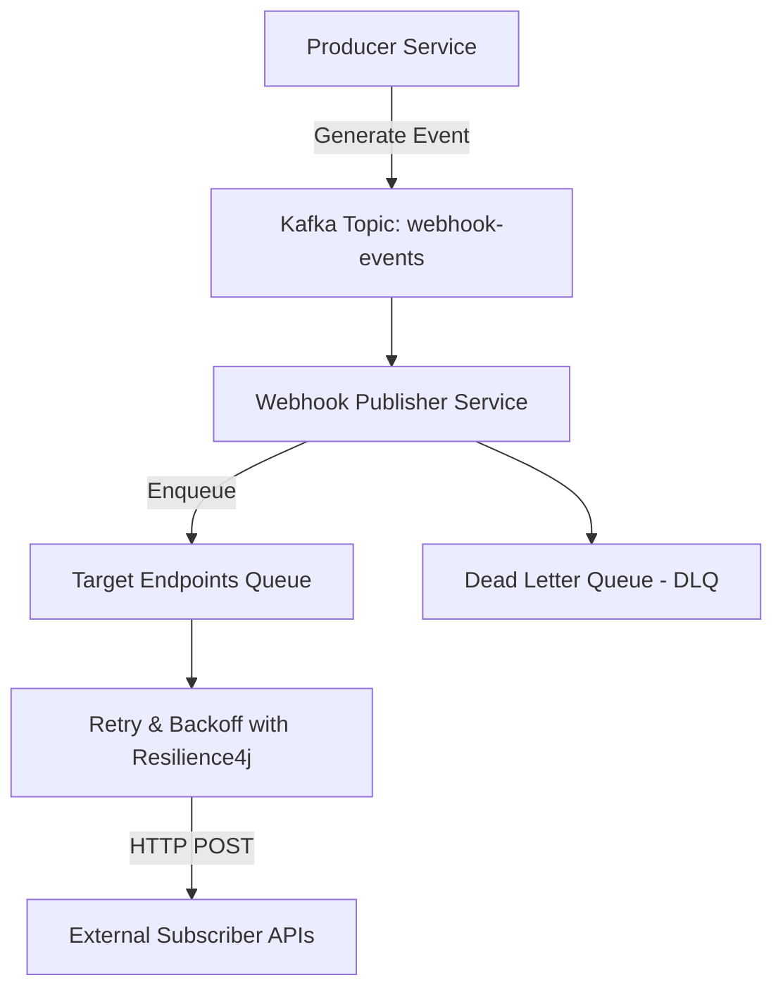
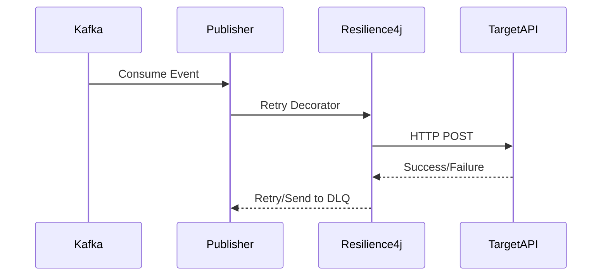

Webhooks are a critical integration pattern for modern SaaS platforms. They allow us to notify downstream services and partners in near real-time whenever important business events occur. But designing a reliable, scalable webhook publisher is far from trivial—especially when you need to guarantee ordering, retries, and throughput.

In this post, I’ll walk through how we approached this challenge and share how we scaled our design to handle 5,000+ events in FIFO order without sacrificing throughput.

## Challenges with Webhook Delivery

At first glance, sending a webhook looks simple:

1. Capture an event
1. Transform it into a payload 
2. POST it to a configured endpoint 

But real-world complexity quickly creeps in:

- Unreliable endpoints: Targets may be slow, down, or return errors. 
- Retry semantics: How many times should we retry? With what backoff? 
- Ordering guarantees: Certain events must be delivered in the exact order they occurred. 
- Scalability: Handling spikes of tens of thousands of events without introducing bottlenecks. 
- Multi-endpoint delivery: Same event may need to go to multiple destinations.

We wanted a design that handled all of these gracefully.

## Key Design Goals

- FIFO Guarantees → Deliver events in the order they were produced. 
- Retry & Backoff → Automatic retries with exponential backoff (powered by Spring Retry / Resilience4j). 
- Multi-endpoint support → Ability to fan out events to multiple subscriber endpoints. 
- High Throughput → 5K+ messages queued while ensuring delivery reliability. 
- Observability → Metrics, logging, and dead-letter queues (DLQ) for failed deliveries.

## The Architecture

Here’s a high-level breakdown of the architecture:



### 1. Event Publisher (Producer) 

Business services publish domain events (e.g., subscription created, order shipped) to Kafka.

### 2. Webhook Publisher Service (Consumer)

- Consumes events from Kafka. 
- Looks up registered webhook subscriptions. 
- Enqueues each outbound delivery request.

### 3. FIFO Queue (Kafka Topic)

- Each target endpoint has a dedicated partition to maintain ordering. 
- Kafka provides backpressure and durability.

### 4. Delivery Workers

- Spring Boot + Kafka consumers handle actual delivery. 
- Retries are managed using Spring Retry or Resilience4j with exponential backoff. 
- Failures are routed to a DLQ for later inspection.

### 5. Monitoring & Alerting

- Exposed metrics on latency, retries, DLQ size. 
- Dashboards for delivery success/failure rates.

## Retry Strategy

Instead of reinventing retry logic, we leaned on [Resilience4j](https://resilience4j.readme.io/docs/getting-started) with exponential backoff.

### Retry & Backoff with Resilience4j

Here’s how we configured retries:

```java
import io.github.resilience4j.retry.*;
import io.github.resilience4j.retry.interval.*;
import java.time.Duration;

RetryConfig retryConfig = RetryConfig.custom()
        .maxAttempts(5) // configurable per endpoint
        .intervalFunction(IntervalFunction.ofExponentialBackoff(
                500,   // initial wait 500ms
                2.0    // multiplier
        ))
        .retryExceptions(RuntimeException.class)
        .build();

RetryRegistry registry = RetryRegistry.of(retryConfig);
Retry retry = registry.retry("webhookPublisher");
```

Each outbound HTTP call will be wrapped with this retry policy to prevent message loss.

✅ Each failed webhook request is retried with exponential backoff.
✅ If all attempts fail → message is routed to DLQ.

### Circuit Breaker Protection

If an endpoint is failing consistently, we trip a circuit breaker to stop flooding it.

```java
CircuitBreakerConfig config = CircuitBreakerConfig.custom()
    .failureRateThreshold(50)
    .waitDurationInOpenState(Duration.ofSeconds(30))
    .slidingWindowSize(20)
    .build();
```

### Dead Letter Queue (DLQ)

If retries are exhausted, events are pushed to a DLQ for later inspection and reprocessing.


## Scaling Considerations

- Multiple webhook publisher instances can consume from Kafka in parallel. 
- As long as Kafka message partitioning is aligned, FIFO is preserved. → ensure events for the same subscriber go to the same partition.
- Consumer group concurrency → scale horizontally across subscribers.
- At-most-once per subscriber FIFO → guaranteed by Kafka ordering + single-threaded consumer per partition. 
- Backpressure Handling Kafka acts as a natural buffer when endpoints are slow. 
- Resilience4j prevents system-wide slowdowns via bulkhead + rate limiter.



## Operational Tuning

Scaling webhooks isn’t just about design—it’s about tuning. Here are some lessons learned:

### 1. Kafka Tuning

- **Partitions** → More partitions = higher parallelism. For 50K+ events, start with `~20–50` partitions.
- **Consumer lag monitoring** → Alert if `lag` > `threshold`.

### 2. Retry Tuning

- Don’t retry forever → use `maxAttempts` + **DLQ**. 
- Use exponential backoff with jitter to avoid thundering herds. 
- Different endpoints may need different retry configs.

### 3. Throughput vs Latency

- Batch sending can increase throughput but increases latency. 
- For strict FIFO, **stick to single-threaded partition consumers**.
- Configure dynamic backoff strategies.
- Use `RateLimiter` to cap requests per endpoint.
- Configure connection pools and timeouts properly.

### 4. Circuit Breakers

- Prevent hammering failing subscribers with a circuit breaker. 
- Auto-recover after a cool-down period.

### 5. Metrics & Observability

- Track success/failure rates, retry counts, DLQ volume. 
- Dashboards for endpoint health and consumer lag.
- Tracing with OpenTelemetry for end-to-end visibility.

> Pro tip: Monitoring DLQ growth is key—if retries are masking persistent failures, you’ll know quickly.

## Lessons Learned

1. FIFO vs. Throughput is always a trade-off → We solved it using Kafka partition-per-endpoint. 
2. Retries need circuit breakers → Otherwise a single slow endpoint can stall the system. 
3. Observability is non-negotiable → DLQs, metrics, and dashboards saved us more than once. 
4. Start simple, evolve → We began with single-endpoint retries, then expanded to multi-endpoint fanout.

## Closing Thoughts

Designing a webhook system that’s both reliable and scalable takes careful planning. By combining Kafka, Spring Boot, and Resilience4j/Spring Retry, we built a system that reliably delivers thousands of webhook events per minute, all while preserving ordering guarantees.

Have you faced similar challenges scaling webhook systems? Share your experience in the comments below!

