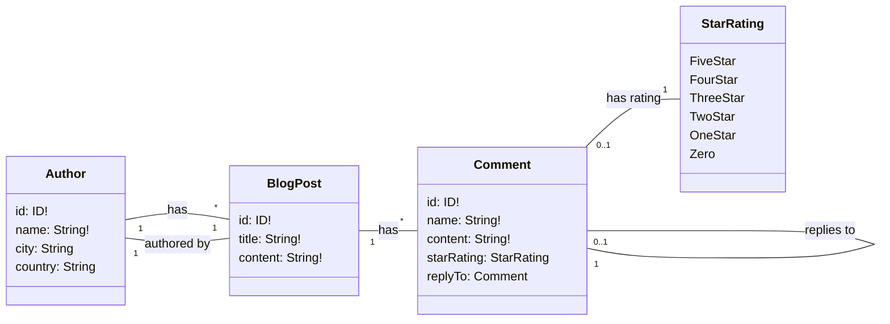

**Dgraph** is a **distributed, fast, and highly scalable graph database** designed for efficient storage and querying of connected data. Unlike traditional relational databases, Dgraph excels at handling **complex relationships** and **graph queries** at scale, making it ideal for applications like social networks, recommendation engines, and knowledge graphs. Dgraph also supports **native GraphQL APIs**, enabling developers to interact with graph data using familiar GraphQL queries and mutations.

In this walkthrough, we’ll go step by step to get **Dgraph up and running locally**, explore a simple blog-post schema, and demonstrate common GraphQL operations.

> **Disclaimer:** The notes and commands below have been tested on a **Mac computer**.

## Local Setup with Docker Compose

To get started quickly, we can run **Dgraph Zero, Alpha, and Ratel** locally using Docker Compose.

```yaml
version: "3.9"

services:
  zero:
    image: dgraph/dgraph:latest
    container_name: dgraph-zero
    restart: unless-stopped
    ports:
      - "5080:5080"
      - "6080:6080"
    volumes:
      - dgraph_zero:/dgraph
    command: dgraph zero --my=zero:5080

  alpha:
    image: dgraph/dgraph:latest
    container_name: dgraph-alpha
    restart: unless-stopped
    ports:
      - "8080:8080"
      - "9080:9080"
    volumes:
      - dgraph_alpha:/dgraph
      - ./schema:/schema # 🔹 mount host schema folder into container
    command: dgraph alpha --my=alpha:7080 --zero=zero:5080
    depends_on:
      - zero

  ratel:
    image: dgraph/ratel:latest
    container_name: dgraph-ratel
    restart: unless-stopped
    ports:
      - "8000:8000"
    command: dgraph-ratel

volumes:
  dgraph_zero:
  dgraph_alpha:
```

### Running Dgraph

For this walk though, be sure to create a folder called `schema` in the same directory as the `docker-compose.yml` file.

Once the Docker Compose file is saved, we can run the following command to start the containers:

```bash
docker-compose up -d
```

### Verifying Dgraph

Verify that the containers are running by running by following the instructions below.

#### Check dgraph-alpha

Check the health of the Alpha instance by running the following command:

```bash
curl -s localhost:8080/health | jq .
```

**Output:**

```json
[
  {
    "instance": "alpha",
    "address": "alpha:7080",
    "status": "healthy",
    "group": "1",
    "version": "v24.1.4",
    "uptime": 2628,
    "lastEcho": 1757006352,
    "ongoing": [
      "opRollup"
    ],
    "ee_features": [
      "backup_restore",
      "cdc"
    ],
    "max_assigned": 63
  }
]
```

#### Check dgraph-zero

```bash
curl -s localhost:6080/state | jq .
```

**Output:**

The output is very long but should contain the following:

```json
{
  "counter": "27",
  "groups": {
    "1": {
      "members": {
        "1": {
          "id": "1",
          "groupId": 1,
          "addr": "alpha:7080",
          "leader": true,
          "amDead": false,
          "lastUpdate": "1757003728",
          "learner": false,
          "clusterInfoOnly": false,
          "forceGroupId": false
...
```

## BlogPost Schema Overview

We will model a simple blog system with **Authors**, **BlogPosts**, and **Comments** with support for replies and ratings. Here's an entity relationships diagram:



### GraphQL Schema

Below is a GraphQL schema that defines the above entity relationships:

```graphql
type Author {
  id: ID!
  name: String! @id
  city: String
  country: String
  blog: [BlogPost!]
}

type BlogPost {
  id: ID!
  title: String! @id
  content: String!
  author: Author!
  comment: [Comment!]
}

type Comment {
  id: ID!
  name: String!
  content: String!
  starRating: StarRating
  replyTo: Comment
}

enum StarRating {
  FiveStar
  FourStar
  ThreeStar
  TwoStar
  OneStar
  Zero
}
```

> This schema supports nested comments and star ratings for comments, while each blog post is linked to a single author.

Save the above GraphQL schema in a file named `schema.graphql` in the `schema` folder.

### Load Schema into Dgraph

To load the schema into Dgraph, run the following command:



Below is the output of the command:

```bash
sh load-schema.sh schema.graphql
{
  "data": {
    "updateGQLSchema": {
      "gqlSchema": {
        "schema": "type Author {\n  id: ID!\n  name: String! @id\n  city: String\n  country: String\n  blog: [BlogPost!]\n}\n\ntype BlogPost {\n  id: ID!\n  title: String! @id\n  content: String!\n  author: Author!\n  comment: [Comment!]\n}\n\ntype Comment {\n  id: ID!\n  name: String!\n  content: String!\n  starRating: StarRating\n  replyTo: Comment\n}\n\nenum StarRating {\n  FiveStar\n  FourStar\n  ThreeStar\n  TwoStar\n  OneStar\n  Zero\n}\n"
      }
    }
  },
  "extensions": {
    "tracing": {
      "version": 1,
      "startTime": "2025-09-04T17:43:48.186596921Z",
      "endTime": "2025-09-04T17:43:48.280505087Z",
      "duration": 93908209
    }
  }
}
```

## Adding Data via GraphQL

In this section are GraphQL mutations and queries that you can use to add data to Dgraph server.

Unfortunately, you cannot use GraphQL mutations/queries in Dgraph Ratel console, but you can use the [GraphQL Playground](https://github.com/graphql/graphql-playground) to test the mutations and queries.

Install the **GraphQL Playground** by running the following command:

```bash
brew install --cask graphql-playground
```

Once it is installed, you can find it in your **Applications** folder.

Once launched, use the endpoint `http://localhost:8080/graphql` to connect to the GraphQL server.

> NOTE that when any of the mutations or queries below fail, it could be due to the Dgraph `id` values being different. Please run a GraphQL query to understand the IDs of your data.

### 1. Add an Author

```graphql
mutation {
  addAuthor(input: [
    { name: "Jane Doe", city: "New York", country: "USA" }
  ]) {
    author {
      id
      name
      city
      country
    }
  }
}
```

### 2. Add a BlogPost

```graphql
mutation {
    updateBlogPost(
        input: {
            filter: { id: ["0x1"] }
            set: {
                comment: [
                    {
                        name: "Alice"
                        content: "Great article!"
                        starRating: FiveStar
                    }
                ]
            }
        }
    ) {
        blogPost {
            id
            title
            content
            comment {
                id
                name
                content
                starRating
            }
        }
    }
}
```

### 3. Add Comments

#### Top-level Comment

```graphql
mutation {
  updateBlogPost(input: [
    {
      id: "0x1",  # UID of BlogPost
      comment: [
        { name: "Alice", content: "Great article!", starRating: FiveStar }
      ]
    }
  ]) {
    blogPost { id title comment { id name content starRating } }
  }
}
```

#### Reply to Comment

```graphql
mutation {
    updateBlogPost(
        input: {
            filter: { id: ["0x3"] } # BlogPost UID
            set: {
                comment: [
                    {
                        name: "Bob"
                        content: "I agree with Alice!"
                        starRating: FourStar
                        replyTo: { id: "0x4" } # UID of Alice's comment
                    }
                ]
            }
        }
    ) {
        blogPost {
            id
            title
            comment {
                id
                name
                content
                starRating
                replyTo {
                    id
                    name
                    content
                }
            }
        }
    }
}
```

## Querying the Data

```graphql
query {
    queryBlogPost(filter: { title: { eq: "GraphQL with Dgraph" } }) {
        title
        content
        author {
            name
        }
        comment {
            id
            name
            content
            starRating
            replyTo {
                id
                name
                content
                starRating
            }
        }
    }
}
```

> This query returns blog posts with their comments and nested replies.

```json
{
  "data": {
    "queryBlogPost": [
      {
        "title": "GraphQL with Dgraph",
        "content": "An intro guide on using GraphQL with Dgraph.",
        "author": {
          "name": "Jane Doe"
        },
        "comment": [
          {
            "id": "0x4",
            "name": "Alice",
            "content": "Great article!",
            "starRating": "FiveStar",
            "replyTo": null
          },
          {
            "id": "0x5",
            "name": "Bob",
            "content": "I agree with Alice!",
            "starRating": "FourStar",
            "replyTo": {
              "id": "0x4",
              "name": "Alice",
              "content": "Great article!",
              "starRating": "FiveStar"
            }
          }
        ]
      }
    ]
  },
  "extensions": {
    "touched_uids": 22
  }
}
```

## The Beauty of Combining GraphQL with a Graph Database

Using GraphQL with Dgraph enables:

- **Intuitive queries** for connected data without complex joins  
- **Nested mutations** to add deeply linked data in one request  
- **Extensible schema**: you can attach GraphQL resolvers to implement custom logic  

In future blogs, we’ll explore how to use **Dgraph** as a **subgraph** that participates in a **GraphQL federation** using Apollo, unlocking powerful multi-service federation capabilities.

---

## References

- [Dgraph Official Website](https://dgraph.io)  
- [Dgraph Docs: GraphQL API](https://dgraph.io/docs/graphql/)  
- [Dgraph Docker Setup](https://dgraph.io/docs/deploy/docker/)  
- [GraphQL Official Site](https://graphql.org/)  
- [Mermaid Diagrams](https://mermaid.js.org/)
- [Apollo Federation](https://www.apollographql.com/docs/graphos/schema-design/federated-schemas/federation)
