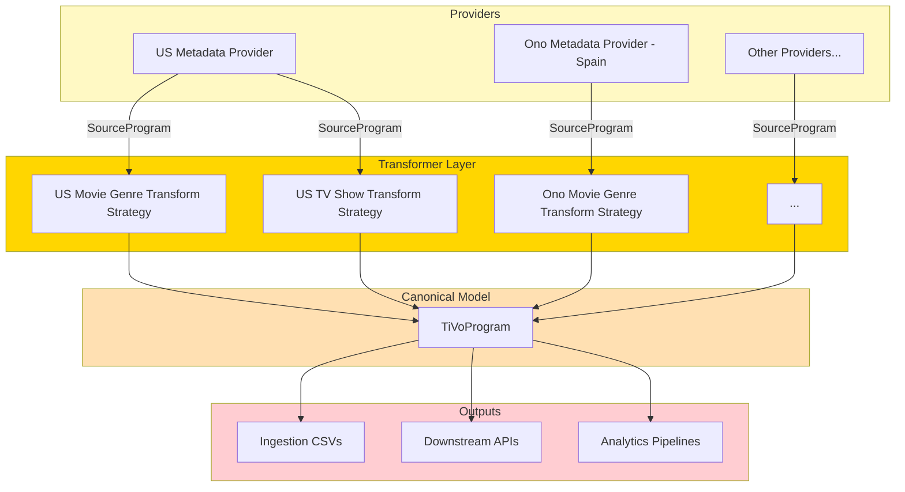

Imagine a global entertainment company’s metadata pipeline held together by a **5,000-line Perl script**—so complex, undocumented, and fragile that every new market or provider felt like defusing a bomb. **Back in 2010–2012, at TiVo, this was our reality.** As the engineer responsible for modernizing this critical system, I saw first-hand how technical debt can throttle business growth and innovation.

Metadata ingestion powers everything from accurate TV and movie listings to personalized recommendations for millions of TiVo users. But as our ambitions grew—to onboard new features and expand into European markets—the legacy Perl script became our biggest bottleneck. It was time for a change.

> **Note:** The challenges and solutions described here reflect TiVo’s metadata ingestion pipeline from over a decade ago. The current architecture has evolved significantly since then.

## The Problem: A Metadata Pipeline on the Brink

Our ingestion pipeline’s backbone—a **5,000-line Perl monolith**—was:

- **Impossible to maintain:** With tangled, undocumented `if-else` logic, even minor changes risked breaking production.
- **Opaque and reactive:** Issues only surfaced after customers complained, with no proactive error detection.
- **Slow to iterate:** Testing updates meant running the entire stack on a single VM, burning hours and sapping morale.
- **Scalability roadblocks:** In-memory processing limited us to vertical scaling—no way to handle growing data volumes efficiently.
- **Blocked business growth:** Expanding into Europe meant retrofitting for new metadata providers, a process so labor-intensive it jeopardized TiVo’s global ambitions.

The Perl script wasn’t just technical debt—it was a barrier to innovation, agility, and market expansion.


It was clear: if TiVo wanted to expand globally, we needed to replace the Perl monster with a system that was **flexible, testable, and scalable by design**.

## The Metadata Monster in the Room: Our 5K-Line Perl Script

Beneath TiVo’s celebrated user experience lurked a daunting technical relic: a single Perl script, sprawling over 5,000 lines, responsible for transforming raw metadata into the lifeblood of our entertainment platform. It wasn’t just legacy code—it was a daily source of anxiety for both engineers and the business.

**Why was this script so infamous?**

- **Opaque Complexity:** With logic buried in layers of nested if-else statements, understanding the script meant decoding years of undocumented tribal knowledge. Even seasoned engineers needed days to trace simple data flows or debug errors.
- **Reactive Firefighting:** When a metadata provider changed a field or format, we often learned about it the hard way—from customer complaints. The lack of proactive error detection meant we were always a step behind, scrambling to patch production issues.
- **Manual, Fragile Testing:** Every update, no matter how minor, demanded a full-scale run of the entire pipeline on dedicated VM servers. Engineers spent hours validating outputs—time that could have been better spent building features or improving reliability.
- **Scalability Dead-ends:** Designed for in-memory processing, the script could only be scaled vertically by throwing more hardware at a single server. As our markets and data volumes grew, so did the risk of outages and slowdowns.
- **Blocked Growth:** Expanding into Europe was a business imperative, yet each new provider required painstaking retrofits, risking downtime and derailing timelines. The rigidity of the script repeatedly turned opportunity into risk.

**A real-world example:**
When one Gracenote (our US metadata provider) silently altered their genre codes, our pipeline processed their files without complaint—but downstream recommendations became garbled. It took weeks of detective work to uncover the root cause, fix the script, and restore data quality. Meanwhile, expansion plans suffered.

The Perl script didn’t just slow us down; it was a ticking time bomb threatening reliability and innovation. We needed to break out of this pattern—replacing fragility with flexibility, and opacity with clarity.

## Advocating for Change: A Leap Towards Modernity

I saw an opportunity for a fundamental shift. I advocated for a complete overhaul, proposing a move to a Java-based application, specifically leveraging the **Spring Boot** framework with **Spring Batch**. My proposal wasn't just about rewriting code; it was about introducing robust engineering practices, testability, and a flexible architecture.

The goal was clear:

* **Introduce Unit and End-To-End Testing:** Ensure code reliability and prevent regressions.  
* **Enhance Maintainability:** Break down complexity into manageable, understandable components.  
* **Be Agile:** Rapidly onboard new metadata providers and adapt to changes.  
* **Enable Horizontal Scaling:** Move beyond the limitations of single-instance, in-memory processing.

## The New Architecture: A Strategy-Based Pipeline

Our solution leveraged the power of **Spring Batch** to create a highly configurable and testable ingestion pipeline. The most significant architectural change was the complete elimination of the monolithic `if-else` logic in favor of a **strategy pattern**.

### Strategy Interface

We introduced a **strategy interface** that transformed metadata provider inputs into TiVo’s canonical format:

```java
interface ProgramTransformer<T extends SourceProgram> {
    /**
     * Determines whether this strategy supports the given source.
     *
     * @param metadataContext Contextual information about the metadata provider
     * @return {@code true} if this instance is capable of transforming this source metadata
     */
    boolean supports(MetadataContext metadataContext);

    /**
     * Transforms the given source into a canonical {@link TiVoProgram} format.
     *
     * @param source Instance of the source metadata to be transformed
     * @param metadataContext Contextual information about the metadata provider 
     * @return A canonical representation of the source metadata
     */
    TiVoProgram transform(T source, MetadataContext metadataContext);
}
```

Here’s how it worked:

- `SourceProgram` represents the common denominator for program metadata, whether a TV show or a movie.
- Each implementation of `ProgramTransformer` handled provider-specific transformations, mapping raw metadata into TiVo’s `TiVoProgram` model.
- Example strategies included:
  - `USMovieGenreTransformStrategy` - transforms US movie genre details.
  - `USTvShowTransformStrategy` - transforms US TV show genre details.
  - `OnoMovieGenreTransformStrategy` (for a Spanish metadata provider called Ono)
  - `OnoTVGenreTransformStrategy` (for a Spanish metadata provider called Ono)
  - Many more others. Too many to mention here.

The strategy pattern was also used to **validate** and **transform** metadata.

Instead of maintaining one massive script that tried to cover every case, we now had **modular, testable classes**. Each new provider could be onboarded by plugging in an existing transformer or writing a new one—without disturbing the rest of the pipeline.

### Strategy Chains

Once we had the `ProgramTransformer` interface, assembling provider-specific pipelines became straightforward. For example, a US metadata provider might require a chain of transformers for TV shows, while a European provider like Ono required a slightly different chain for movies.

A `ProgramImporter` class was introduced to encapsulate the logic of importing metadata from a specific metadata provider:

```java
class abstract ProgramImporter<SourceProgram> {
    private final List<ProgramTransformer<? extends SourceProgram>> transformers;
    ...

    /**
     * Determines whether this importer supports the given source.
     * 
     * @param metadataContext Contextual information about the metadata provider
     * @return {@code true} if this importer supports the given source  
     */
    public abstract boolean supports(MetadataContext metadataContext);

    /**
     * Transforms the given source into a canonical {@link TiVoProgram} format.
     * 
     * @param source Instance of the source metadata to be transformed
     * @param metadataContext Contextual information about the metadata provider 
     * @return A canonical representation of the source metadata
     */
    public TiVoProgram transform(SourceProgram source, MetadataContext metadataContext) {
        TiVoProgram program = null;
        for (ProgramTransformer<? extends SourceProgram> transformer : transformers) {
            if (transformer.supports(metadataContext)) {
                program = transformer.transform(source, metadataContext);
            }
        }
        return program;
    }
}
```

Each `ProgramImporter` instance was configured with a list of `ProgramTransformer` instances that were specific to the metadata provider.

**Example ONO metadata provider configuration:**

```java
@Prototype // The transformer will be dynamically instantiated by Spring only when importing metadata from ONO metadata provider.
public OnoProgramImporter extends ProgramImporter<OnoProgram> {
    ... // register the transformer here specific to this metadata provider.
}
```

**Example US metadata provider configuration:**

```java
@Prototype // The transformer will be dynamically instantiated by Spring only when importing metadata from US metadata provider. 
public USProgramImporter extends ProgramImporter<USProgram> {
    ... // register the transformer here specific to this metadata provider.
} 
```

Here’s a simplified example of how we configured this in Spring Batch:

```java
@Configuration
public class MetadataIngestionJobConfig {

    @Bean
    public Job metadataIngestionJob(JobRepository jobRepository,
                                    Step transformStep) {
        return new JobBuilder("metadataIngestionJob", jobRepository)
                .start(transformStep)
                .build();
    }

    @Bean
    public Step transformStep(JobRepository jobRepository,
                              PlatformTransactionManager transactionManager,
                              ItemReader<SourceProgram> reader,
                              ItemWriter<TiVoProgram> writer,
                              List<ProgramTransformer<? extends SourceProgram>> transformers) {
        return new StepBuilder("transformStep", jobRepository)
                .<SourceProgram, TiVoProgram>chunk(100, transactionManager)
                .reader(reader)
                .processor(source -> {
                    // Apply matching transformer based on source type/provider
                    for (ProgramTransformer transformer : transformers) {
                        if (transformer.supports(source)) {
                            return transformer.transform(source, MetadataConfigs.defaultConfig());
                        }
                    }
                    throw new IllegalArgumentException("No transformer found for " + source);
                })
                .writer(writer)
                .build();
    }
}
```



### 🔑Key points:

- Each `ProgramTransformer` could implement a simple `supports(SourceProgram source)` method to indicate if it applies.
- The **Spring Batch** processor looped through available strategies and delegated to the right one.
- Adding a new provider was as simple as writing a new `ProgramTransformer` and wiring it into the Spring context.

Instead of one giant script trying to handle every scenario, we now had:

1. **Modular Strategies:** Each `if-else` block from the Perl script was refactored into a focused, testable Java class implementing our strategy interface.  
2. **Configurable Chains:** For each new metadata provider, we simply configured a specific sequence of these strategies. This allowed us to onboard new metadata providers by either plugging in existing strategies or building custom strategies tailored to their unique requirements.  
3. **Spring Batch Power:** Spring Batch provided the robust framework for managing batch jobs, including transaction management, restartability, and comprehensive logging.  
4. **Database-Backed Storage:** By utilizing MySQL as our persistence layer, we moved away from in-memory limitations, enabling data to be stored, queried, and manipulated more effectively. This also allowed us to generate CSV outputs from the database.

## Deployment Strategy: Parallel Run and Shadow Mode

Migrating such a critical system required a careful, low-risk deployment strategy. We chose a **parallel run** approach with a **shadow mode**:

1. **Co-existence:** Initially, the Spring Boot application was deployed alongside the existing Perl script.  
2. **Dual Output & Comparison:** The Perl script continued its primary role of ingesting files and producing its CSV output. However, it was also configured to trigger the new Spring Boot application asynchronously. The Spring Boot application, in turn, parsed the same input file and generated its own output.  
3. **Real-time Diffing:** A crucial step was added to the Spring Boot application to compare its output with the output generated by the Perl script.  
4. **Validation & Refinement:**  
   * For critical discrepancies, we either fixed the Spring Boot application to correctly replicate the desired logic or, if the Perl script's behavior was a non-critical business-specific quirk, we explicitly disabled that particular diff in our comparison logic.  
   * In some cases, the diffs exposed actual bugs in the Perl script, which we then fixed in both systems.  
5. **Confidence Building:** We ran this parallel "shadow mode" for over a month. This period allowed us to build significant confidence in the new system's accuracy and stability under real-world production load.  
6. **Cutover:** Once we were fully confident, we gracefully shut down the Perl script, making the Spring Boot application the primary and sole metadata ingestion engine.

## The Impact: Uncovering Bugs, Accelerating Growth, and Unlocking Scalability

The migration delivered far more than just a modernization—it transformed how we worked:

- **Uncovered hidden bugs:** Unit testing each strategy surfaced long-standing issues in the Perl script. Dozens of defects—some lurking in production for years—were finally fixed.
- **Accelerated onboarding:** What once took weeks of retrofitting could now be done in days by composing new strategy chains. This directly fueled TiVo’s expansion into multiple European markets.
- **Boosted developer confidence:** With modular, testable components, engineers could extend the pipeline without fear of regressions.
- **Scalable by design:** Horizontal scaling through Spring Boot and MySQL lets us ingest growing data volumes simply by adding more instances.
- **Faster iteration cycles:** Automated testing and database-backed validation replaced slow, manual verification, cutting release cycles dramatically.

This wasn’t just a rewrite of a script—it was the removal of a **global bottleneck**. By replacing fragility with flexibility, we turned ingestion into an enabler of growth rather than a blocker.

## Lessons Learned: Making Legacy Modernization Work

- **Parallel runs build trust:** Comparing outputs in real time gave us confidence before making the switch.
- **Tie tech upgrades to business goals:** Leadership championed the project when they saw direct links to growth.
- **Invest in testing up front:** Early unit and integration tests surfaced bugs that had been hidden for years.
- **Monitor relentlessly:** Metrics and dashboards kept us proactive, not reactive, after launch.
- **Celebrate quick wins:** Each bug fixed and provider onboarded was a chance to build momentum.

**Bottom line:** Modernization is not just a technical upgrade—it’s a business strategy. With the right approach, even the most intimidating legacy systems can become engines of agility and growth.

> Thanks to the engineering leadership and team at TiVo, we were able to complete this project in less than 3 months.

Have you modernized a legacy pipeline or have questions about Spring Batch migration? Share your story in the comments.
