When our team at Chegg decided to migrate our in-house commerce system to a SaaS vendor, Recurly, the stakes couldn't have been higher. Tens of millions of students depended on seamless billing and subscription access. A single mistake could have led to broken checkouts, canceled subscriptions, and lost trust.  

But large-scale migrations don't have to be fire drills that burn out your engineering team. With careful planning, incremental rollout, and trust in both people and process, you can deliver a successful migration without sleepless nights.  

This is the story of how we approached our migration to Recurly and the lessons we learned along the way.  

## Why We Started With a Proof of Concept

Every migration begins with uncertainty. Instead of jumping straight into code, we started with a **Proof of Concept (POC)** for both front-end and backend flows.  

- We tested checkout, payments, product management, and subscription lifecycles (creation, renewals, cancellations) for both web and mobile.  
- We documented where Recurly provided parity with Chegg and where it didn't.  

This forced alignment across stakeholders: some legacy features were no longer worth carrying forward, while others required vendor collaboration. The POC became our map for what to build, drop, or renegotiate.  

## Data Decisions: Proxy or Local Copy?

Recurly was set to become our **source of truth** for billing, payments, and subscriptions. Initially, we considered building a proxy service to call Recurly directly for everything.  

Recurly, however, recommended a different approach:  
- Store **local copies of subscription data** (since subscriptions drive checkout, renewals, and cancellations).  
- Query Recurly directly for other data.  

This tradeoff balanced performance, resilience, and simplicity. It also meant defining new **GraphQL schemas** to provide business-friendly APIs that abstracted away vendor-specific quirks.  

**Chegg-Recurly Migration Architecture Overview**

**Component Diagram** 

```mermaid
flowchart TB
 subgraph CheggBackend["🏢 Chegg Backend Services"]
        GraphQL["🔗 Apollo Gateway<br>GraphQL API"]
        Proxy["⚡ Chegg Proxy Service<br>Spring Boot"]
        SubSvc["📋 Subscription Service<br>Spring Boot"]
        Webhook["🎣 Webhook Ingestion<br>Service"]
        RecurlyDB[("🗄️ Local DB<br>Recurly Subscriptions")]
        Legacy["🏛️ Legacy Subscription<br>Services"]
        Kafka["📨 Kafka Topic<br>subscription.events"]
  end
    User["👤 User"] --> Frontend["🖥️ Frontend<br>React/Mobile App"]
    Frontend --> GraphQL
    Recurly["💳 Recurly<br>External SaaS"] -.-> Webhook
    GraphQL --> Proxy & SubSvc
    Proxy --> Recurly
    SubSvc --> RecurlyDB & Legacy
    Webhook --> Kafka
    Kafka --> SubSvc

    Recurly@{ shape: procs}
     GraphQL:::cheggGateway
     Proxy:::cheggService
     SubSvc:::cheggService
     Webhook:::cheggService
     RecurlyDB:::cheggData
     Legacy:::cheggData
     Kafka:::cheggMessaging
     User:::external
     Frontend:::external
     Recurly:::external
    classDef external fill:#ffebee,stroke:#d32f2f,stroke-width:2px
    classDef cheggService fill:#e8f5e8,stroke:#388e3c,stroke-width:1px
    classDef cheggData fill:#fff3e0,stroke:#f57c00,stroke-width:1px
    classDef cheggMessaging fill:#f1f8e9,stroke:#689f38,stroke-width:1px
    classDef cheggGateway fill:#f3e5f5,stroke:#7b1fa2,stroke-width:1px
    style CheggBackend fill:#f8f9fa,stroke:#1976d2,stroke-width:3px,stroke-dasharray: 5 5
```

By designing GraphQL schemas first, we gave frontend and business teams clear contracts. This became a critical leadership tool — APIs as alignment mechanisms.

## Document First, Then Build

Before we built new services, we:

- Created detailed field mappings from legacy schemas to new GraphQL schemas.
- Shared documentation internally to gather early feedback.
- Designed database tables to hold migrated Recurly subscriptions alongside legacy data.

This deliberate, documentation-first approach helped us move faster later — teams were aligned before code was written.

## Incremental Rollouts With Optimizely

We didn't flip the switch overnight. Using **Optimizely** (a feature flagging and experimentation platform that allows controlled rollouts to specific user segments), we:

- Directed new cohorts of users to the Recurly checkout flow.
- Served subscription data for all users through the new GraphQL APIs.

This meant the frontend never had to decide which backend to call. It also gave us confidence: if something broke, only a small cohort was affected.

**Figure 2: Incremental Rollout Strategy Using Optimizely Cohorts**  

The incremental rollout was not just a technical choice — it was a leadership choice to protect both customers and engineers from high-stress cutovers.

## The Migration Pipeline

Once our APIs and rollout plan were in place, we turned to the hardest part: migrating millions of active subscriptions.

The migration process was async and CSV-driven:

1. **Prepare CSV files** in Recurly's format (users, products, billing tokens, subscriptions).
2. **Publish to S3**, where Recurly ingested them.
3. **Validate**: Recurly returned validation errors, which we reviewed before ingestion.
4. **Ingest**: Records were imported, triggering webhook events.
5. **Distribute**: Webhook events were pushed into Kafka and consumed by subscription services.
6. **Compensate**: A compensation microservice reconciled async state mismatches (e.g., cancellations during migration).

This pipeline reduced manual effort and gave us confidence in correctness.

## Avoiding Bottlenecks in Production

Migration ETL jobs can overwhelm live databases. To avoid bottlenecks:

- We replicated legacy data into migration-specific tables using **AWS DMS**.
- We ran **Spring Batch jobs on AWS Batch** to generate CSVs asynchronously.

This separation ensured regular users weren't impacted while migration jobs crunched millions of records.

## Challenges We Encountered

Despite careful planning, we hit several significant roadblocks that taught us valuable lessons:

**Data Inconsistencies**: Legacy data had accumulated years of edge cases — subscriptions with missing billing tokens, orphaned records, and inconsistent state transitions. What seemed like clean data in our POC revealed complexities at scale.

**Vendor API Limitations**: Recurly's bulk import had undocumented rate limits and timeout behaviors that only surfaced when processing millions of records. We had to implement exponential backoff and chunking strategies mid-migration.

**Webhook Delivery Delays**: During peak processing, Recurly's webhook delivery experienced delays of several minutes. Our compensation service had to handle out-of-order events and duplicate deliveries more gracefully than initially designed.

**Cross-System Dependencies**: Other Chegg services that depended on subscription data had assumptions about data freshness and consistency that broke during the async migration. We discovered these dependencies through production alerts, not testing.

**Team Coordination**: With multiple teams working in parallel (frontend, backend, data, QA), staying synchronized became increasingly difficult. Feature branches diverged, integration environments fell out of sync, and communication overhead grew exponentially.

The key insight: **plan for 3x more edge cases than your POC reveals**. Production data and production scale always surprise you.

## Leadership Lessons: Avoiding Burnout

Technical success alone isn't enough. Large migrations can easily turn into multi-month slogs that drain morale. Here's what worked for us:

- Cohort rollouts reduced stress by lowering blast radius.
- Automation everywhere (batch jobs, CSV pipelines, compensation services) prevented long nights of manual fixes.
- Cross-team alignment: GraphQL schemas and documentation acted as contracts, preventing rework.
- Celebrating milestones kept morale high — every batch migrated was a reason to celebrate.

## Key Takeaways

Looking back, here's our playbook for running large migrations without burning out your team:

- Start with a **POC** to align stakeholders and clarify tradeoffs.
- Define **APIs** and schemas first — they are the contracts across business and engineering.
- Roll out incrementally with feature flags or experiments.
- Invest in compensation workflows — async migrations will always have edge cases.
- Protect your team with automation, observability, and clear milestones.

Large-scale migrations will never be trivial. But with the right approach, they can be opportunities to build trust, strengthen culture, and modernize systems — all without burning out the people who make it possible.

Done right, migrations don't just upgrade systems. They upgrade teams.

