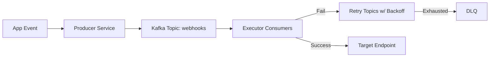

Webhooks are a critical integration pattern in modern SaaS platforms. They allow external systems to subscribe to events and react in near real-time. However, reliability is often underestimated. What happens when the target system is down, slow, or returns transient errors? Without careful design, you risk dropped events, duplicated deliveries, or system overload.

In this post, I’ll walk through how to design a webhook delivery system that is **resilient, scalable, and developer-friendly**.

---

## ⚡ Key Requirements
1. **At-Least-Once Delivery** – Ensure no webhook is silently lost.  
2. **Configurable Retries** – Each endpoint can have different retry/backoff strategies.  
3. **Dead-Letter Queue (DLQ)** – Persist failures for manual or automated reprocessing.  
4. **Scalability** – Handle thousands of events per second without blocking.  
5. **FIFO Ordering (Optional)** – Preserve order for endpoints that require it.  

---

## 🏗️ Architecture Overview
Here’s the high-level design I used in a recent system:

- **Producer Service**: Publishes webhook events to a **Kafka topic**.  
- **Consumer Executors**: Pick up messages, attempt delivery via HTTP.  
- **Spring Retry + Exponential Backoff**: Automatically retries transient failures.  
- **Retry Topics**: Events are routed to retry topics (`retry-5s`, `retry-1m`, etc.) depending on backoff.  
- **DLQ**: After max retries, events are sent to a DLQ for investigation.  



---

⚙️ Implementation Details

Spring Boot + Spring Kafka for producer/consumer logic.

Spring Retry for retry/backoff configuration.

Customizable Retry Config: Each endpoint has its own retry policy (some need quick retries, others tolerate delays).

Audit Logging: Every attempt is logged for observability.


Example retry config (YAML snippet):

```yaml
webhook:
  retries:
    default:
      attempts: 5
      backoff: exponential
      multiplier: 2.0
      max-interval: 5m
    payment-service:
      attempts: 10
      backoff: fixed
      interval: 30s
```

---

🚨 Lessons Learned

1. Retry Storms Are Real – Without backoff, retries can overwhelm downstream services.
2. Observability is Non-Negotiable – Metrics and logs must capture every attempt, failure, and retry.
3. One Size Doesn’t Fit All – Different consumers need different retry strategies.
4. DLQs Are Your Safety Net – They turn failures into actionable insights, not lost data.

---

✅ Final Thoughts

A well-designed webhook system is not just about sending HTTP requests. It’s about building trust with your consumers by guaranteeing reliability, transparency, and resilience.

If you’re designing integrations at scale, treat webhooks as first-class citizens in your architecture — with the same rigor as any other API.

---

Next up: I’ll share how we scaled this design to handle 5K+ events in FIFO order without impacting throughput.
