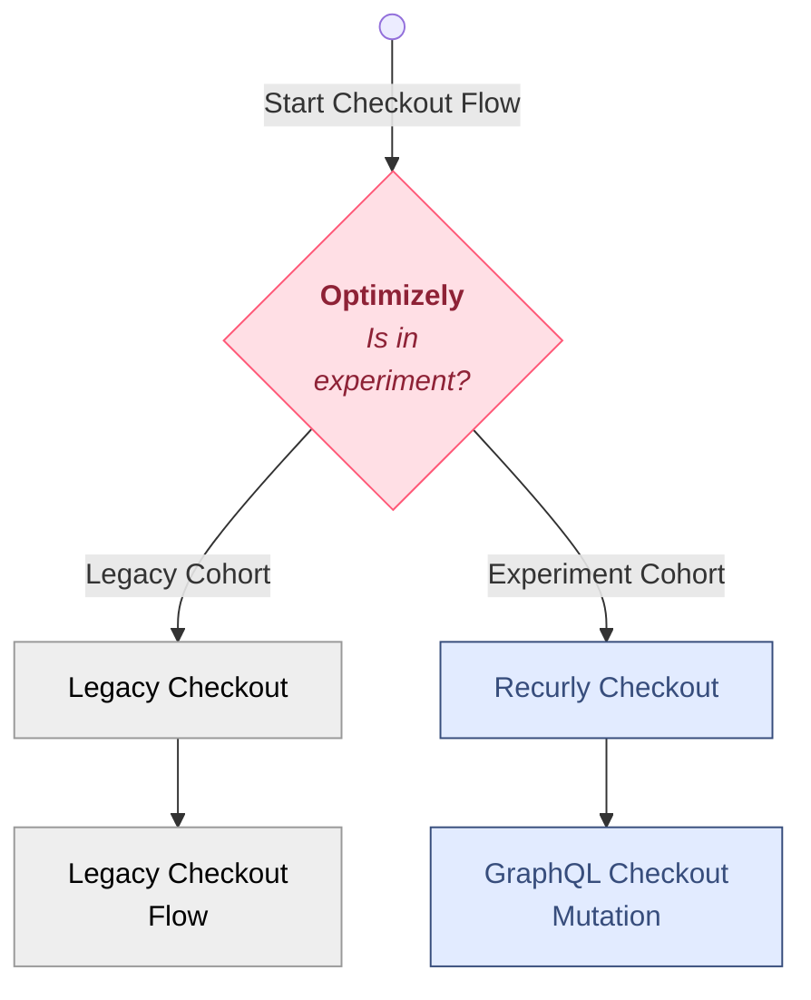
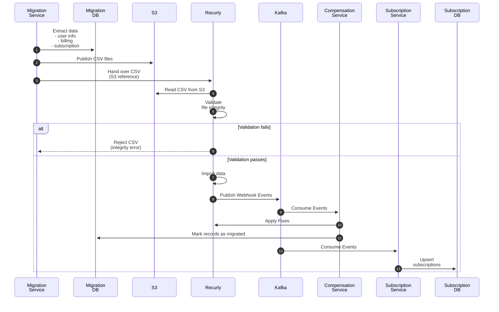
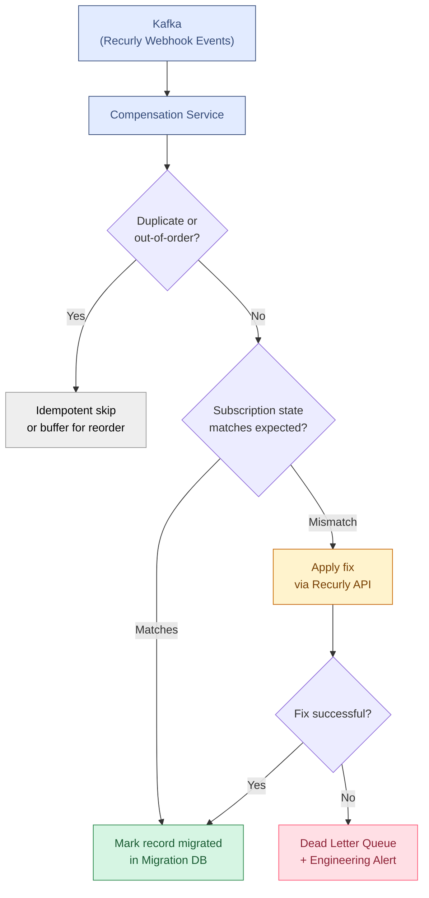

Migrating Chegg's in-house commerce system to Recurly meant moving billing infrastructure that tens of millions of students relied on daily. This post is written for engineers and engineering managers leading or evaluating a large-scale SaaS billing migration. The patterns documented here — cohort rollouts, API-first design, compensation services — apply to any live production system with active users that must be replaced without a maintenance window.

**Initial state:** A custom-built commerce platform owned checkout, subscriptions, billing, and renewals. **Constraint:** Active student subscriptions had to remain uninterrupted during academic terms — a disruption meant students losing access to study materials during finals. Broken checkouts or disrupted subscription access were not abstractions — they were the failure modes every architectural decision was designed to prevent.  

**TL;DR**  

- Start with a focused POC; design APIs and schemas first as alignment contracts.
- Roll out in cohorts with feature flags (Optimizely); use CSV-driven S3 imports into Recurly and webhook-driven distribution to Kafka.  
- Automate reconciliation with compensation services to handle edge cases — protect both customers and engineering teams.  

<picture>
  <source type="image/webp" srcset="/assets/images/chegg-commerce-migration-recurly.webp 1x, /assets/images/chegg-commerce-migration-recurly@2x.webp 2x">
  
</picture>

But large-scale migrations do not have to be fire drills that burn out your engineering team. With careful planning, incremental rollout, and trust in both people and process, it is possible to deliver a successful migration without sleepless nights.  

This is the story of how the team approached the migration to Recurly and the lessons learned along the way.  

## Before vs After

| Aspect             | Before (Legacy System)                            | After (Recurly-Based System)                                    |
| ------------------ | ------------------------------------------------- | --------------------------------------------------------------- |
| Checkout           | Custom-built, maintained in-house                 | Recurly-hosted, maintained by vendor                            |
| Subscription state | Owned and persisted in custom services            | Local copies synced via webhooks from Recurly                   |
| Payment processing | Braintree tightly coupled to legacy services      | Braintree tokens migrated into Recurly; Recurly manages billing |
| API surface        | Internal service-to-service APIs, tightly coupled | Federated GraphQL schemas — business-friendly contracts         |
| Rollout control    | All-or-nothing deployment                         | Feature-flag-driven cohort rollouts via Optimizely              |
| Edge case handling | Manual intervention during incidents              | Automated compensation service with dead letter queues          |
| Vendor scalability | Limited by in-house infrastructure                | SaaS vendor scales independently                                |

## Why We Started With a Proof of Concept

Every migration begins with uncertainty. Instead of jumping straight into code, we started with a **Proof of Concept (POC)** for both front-end and backend flows.  

- We tested checkout, payments, product management, and subscription lifecycles (creation, renewals, cancellations) for both web and mobile.  
- We documented where Recurly provided parity with Chegg and where it did not.  

This forced alignment across stakeholders: some legacy features were no longer worth carrying forward, while others required vendor collaboration. The POC became our map for what to build, drop, or renegotiate.  

## Data Decisions: Proxy or Local Copy?

Recurly was set to become the **source of truth** for billing, payments, and subscriptions. The first architectural question: should services proxy all reads to Recurly, or maintain local copies of subscription data?

**Options considered:**

| Option                                   | Latency                               | Resilience                            | Consistency           | Complexity                     |
| ---------------------------------------- | ------------------------------------- | ------------------------------------- | --------------------- | ------------------------------ |
| Proxy all reads to Recurly               | Recurly API latency on every checkout | Recurly outage = checkout outage      | Always fresh          | Low                            |
| **Local copy + webhook sync (selected)** | Low — local DB read                   | Local data survives Recurly downtime  | Eventually consistent | Medium                         |
| Each service calls Recurly independently | Recurly API latency per service       | Recurly outage = all services degrade | Always fresh          | High — N independent couplings |

**Decision:** Store local copies of subscription data; query Recurly directly for non-subscription data.

Recurly recommended this approach. Checkout performance and resilience during vendor downtime mattered more than perfect read freshness — and the compensation service would handle consistency.

**Long-term implication:** Local copies required the Compensation Service to be reliable infrastructure from day one, not optional cleanup tooling. This shaped the entire migration architecture — the data model was only correct if the compensation service was operational.

This decision also meant defining new **GraphQL schemas** to provide business-friendly APIs that abstracted away vendor-specific quirks. By designing GraphQL schemas first, frontend and business teams had clear contracts before any service was built. This became a critical leadership tool — APIs as alignment mechanisms.

## API Contracts: Design Before You Build

With the POC complete, we shifted from exploration to deliberate design. Before writing a single line of service code, we:

- Designed and implemented target GraphQL schemas to support the SaaS use case.
- Created detailed field mappings from legacy schemas to new GraphQL schemas.
- Shared documentation internally to gather early feedback.
- Designed database tables to hold migrated Recurly subscriptions alongside legacy data.

We adopted a federated GraphQL design (Apollo Federation) to allow teams to own schemas and compose a unified API surface for frontend consumers.

This deliberate, documentation-first approach helped us move faster later — teams were aligned before code was written.

### Target architecture

The diagram below shows our target state during the migration and still includes the **Legacy Subscription Services** because the cutover had not yet completed. After the migration finished, those legacy services were deprecated and removed.

**Note:** the diagram focuses on the subscription migration flow and omits other downstream consumers (Account Service, chargeback monitor, fraud pipelines, analytics, billing reconciliation, etc.) for brevity.

## Incremental Rollouts With Optimizely

We did not flip the switch overnight. Using **Optimizely** (a feature flagging and experimentation platform that allows controlled rollouts to specific user segments), we:

- Directed new cohorts of users to the Recurly checkout flow.
- Served subscription data for all users through the new GraphQL APIs.

This meant the frontend never had to decide which backend to call. It also gave us confidence: if something broke, only a small cohort was affected.

**Figure 2: Incremental Rollout Strategy Using Optimizely Cohorts**  

The incremental rollout was not just a technical choice — it was a leadership choice to protect both customers and engineers from high-stress cutovers.

## The Migration Pipeline

Once our APIs and rollout plan were in place, we turned to the hardest part: migrating approximately [X million] active subscriptions across [N] cohorts over [Y] weeks.

The migration process was async and CSV-driven:

1. **Prepare CSV files** in Recurly's format (users, products, billing tokens, subscriptions).
2. **Publish to S3**, where Recurly ingested them.
3. **Validate**: Recurly returned validation errors, which we reviewed before ingestion.
4. **Ingest**: Recurly imported the validated CSV files from S3 (its bulk import process), which created account/product/subscription records in the vendor.
5. **Distribute**: Recurly's import triggered webhook events that were pushed into Kafka and consumed by multiple Chegg services — chief among them the Subscription service and the Compensation service, along with other downstream consumers.
6. **Compensate**: A compensation microservice reconciled async state mismatches (e.g., cancellations during migration).

This pipeline reduced manual effort and gave us confidence in correctness.

### Avoiding Bottlenecks in Production

Migration ETL jobs can overwhelm live databases. To avoid bottlenecks:

- We replicated legacy data into migration-specific tables using **AWS DMS**.
- We ran **Spring Batch jobs on AWS Batch** to generate CSVs asynchronously.

This separation ensured regular users weren't impacted while migration jobs crunched millions of records.

### Cohort-based rollout (not a big-bang)

We ran the migration as an iterative, cohort-based program rather than a single cutover. The rollout followed a repeatable loop:

- **Pick a cohort**
  - Start with low-volume / low-risk segments (small countries, non-critical accounts)
  - Purpose: validate ingestion, webhook delivery, consumer processing, and reconciliation
- **Run the migration for the cohort**
  - Publish CSVs → Recurly import → webhooks → Kafka consumers
- **Monitor and validate**
  - Acceptance criteria: ingestion success rate, webhook delivery latency, consumer error rate, reconciliation pass rate
  - Perform manual spot checks for representative accounts and billing flows
- **Decide**
  - If metrics and checks pass → scale to the next cohort
  - If failures appear → pause, compensate, fix, and re-run the cohort

#### Key notes

- We intentionally picked cohorts to exercise different edge cases (billing tokens, cancellations, cross-service dependencies).

- This approach limited blast radius and let us iterate on chunking, backoff, and compensation strategies before moving to larger populations.

#### When to pause or roll back

Not every cohort ran cleanly. Our decision criteria:

- **Continue** if ingestion success rate, webhook delivery latency, consumer error rate, and reconciliation pass rate all met acceptance thresholds.
- **Pause and compensate** if failures were isolated to a known edge case with a clear fix — remediate, then re-run the cohort.
- **Roll back** by stopping new CSV ingestion and reverting the Optimizely flag to route users back to the legacy system. Because feature flags controlled routing, a rollback required no frontend deployments.

The key protection: the Optimizely flag was always a zero-code escape valve available at any point in the rollout.

## Compensation Service Deep Dive

The compensation service was one of the most critical components of the migration — not an afterthought. It made correctness provable in an inherently async system.

### What problems does it solve?

Async migrations produce predictable failure modes:

- **Out-of-order webhook delivery**: A cancellation event arrives before the subscription-created event.
- **Duplicate delivery**: Recurly retries a webhook that was already processed.
- **State drift**: A subscription is cancelled *during* the migration window — the webhook arrives, but the local subscription copy hasn't been created yet.
- **Mid-migration modifications**: A user upgrades or downgrades their plan between CSV export and Recurly import completion.

### How it worked

### Design principles

- **Idempotent processing**: Every fix was safe to apply multiple times — no double-cancellations, no duplicate state updates.
- **Event log as source of truth**: Kafka's event log was the authoritative replay source for debugging and audit.
- **Dead letter queues, not silent failures**: Events that could not be automatically resolved were routed for manual review. Nothing was ever silently dropped.

## Challenges We Encountered

Despite careful planning, the team encountered several significant roadblocks. The table below provides a quick-reference summary:

| Challenge                        | Root Cause                                       | Fix                                                               |
| -------------------------------- | ------------------------------------------------ | ----------------------------------------------------------------- |
| Data inconsistencies             | Years of legacy edge cases at scale              | Validation & cleanup scripts pre-migration                        |
| Vendor API rate limits           | CSV import triggered Recurly APIs at high volume | Proactive rate limit increases (no extra charge)                  |
| Braintree token gaps             | Tokens inactive until first use in Recurly       | Fallback to legacy data store for card details                    |
| Test vs. prod environment drift  | Mock data did not reflect production complexity  | End-to-end validation in controlled prod runs                     |
| Webhook delivery delays          | Peak processing caused minutes-long delays       | Compensation service redesigned for out-of-order/duplicate events |
| Legacy data special cases        | Edge cases absent from vendor docs               | Testing against actual production data patterns                   |
| Cross-system dependency breakage | Downstream services assumed sync data freshness  | Service dependency mapping before future migrations               |

- **Data Inconsistencies**:
  - Legacy data had accumulated years of edge cases — subscriptions with missing billing tokens, orphaned records, and inconsistent state transitions.
  - What seemed like clean data in our POC revealed complexities at scale.
  - These inconsistencies required additional validation and cleanup scripts before migration.
- **Vendor API Limitations**:
  - Recurly's CSV import process internally called their own APIs at high volume.
  - This caused us to hit rate limits during large ingestion batches.
  - The issue surfaced early in our migration testing.
  - Recurly was responsive and proactively increased our rate limits before each major ingest without additional charges.
- **Braintree Tokens**:
  - Though we migrated Braintree tokens, we could not fetch credit card details from the corresponding tokens until the tokens were used within Recurly.
  - The issue affected our ability to display complete payment information to customers post-migration.
  - We built fallback logic to retrieve card details from our legacy data store when billing information was sparse in Recurly.
- **Inconsistencies in vendor's test and production environments**:
  - Vendor test environments often use mock data with simplified behaviors.
  - Some complex production cases only surfaced in live runs despite thorough testing.
  - We learned to always verify end-to-end flows in controlled production environments before full rollout.
- **Webhook Delivery Delays**:
  - During peak processing, Recurly's webhook delivery experienced delays of several minutes.
  - This created race conditions between different subscription-related events.
  - Our compensation service had to be redesigned to handle out-of-order events and duplicate deliveries more gracefully.
- **Legacy Data Special Cases**:
  - The team encountered legacy data with special use cases that were not covered by Recurly's documentation.
  - These edge cases only surfaced during migration, not during our initial POC.
  - For example, certain subscription modifications that were standard in our legacy system had no direct equivalent in Recurly's data model.
  - This taught us to never blindly follow vendor documentation—test everything thoroughly against your actual production data patterns.
- **Cross-System Dependencies**:
  - Other Chegg services depended on subscription data with assumptions about freshness and consistency.
  - These assumptions broke during the async migration process.
  - We discovered many of these dependencies through production alerts rather than testing.
  - This led us to implement a more comprehensive service dependency mapping before future migrations.

The key insight: **plan for 3x more edge cases than your POC reveals**. Production data and production scale always surprise you.

## Leadership Lessons: Avoiding Burnout

Technical success alone is not enough. Large migrations can easily turn into multi-month slogs that drain morale. What worked for the team:

- Cohort rollouts reduced stress by lowering blast radius.
- Automation everywhere (batch jobs, CSV pipelines, compensation services) prevented long nights of manual fixes.
- Cross-team alignment: GraphQL schemas and documentation acted as contracts, preventing rework.
- Celebrating milestones kept morale high — every batch migrated was a reason to celebrate.

## Anti-Patterns to Avoid

The challenges encountered during this migration reveal a set of patterns that appear reasonable on paper but cause significant problems at scale. Avoid these on future migrations:

- **Do not assume the proxy pattern is the simplest option.** Proxying all reads to a vendor API feels like low complexity, but a vendor outage instantly degrades checkout for every user. Local copies with webhook sync isolate customers from vendor instability.
- **Do not treat the compensation service as optional.** It is tempting to defer reconciliation logic until edge cases appear. By the time the first cohort reveals state drift, a missing compensation service means manual fixes at scale. Build it before the first CSV is ingested.
- **Do not extrapolate from vendor test environments.** Test environments use mock data with simplified behaviors. Complex production cases — orphaned records, legacy billing tokens, cross-system state transitions — only surface in live runs. Validate end-to-end flows in a controlled production environment before each cohort.
- **Do not migrate without a dependency map.** Downstream services carry undocumented assumptions about data freshness and consistency. Discover those assumptions through explicit mapping before the migration starts — not through production alerts after it does.
- **Do not big-bang the cutover.** A single large cutover maximizes blast radius and minimizes recovery options. Each cohort is a unit of risk: failures are isolated, fixable, and learnable before they affect the full user population.
- **Do not follow vendor documentation blindly.** Recurly's documentation was accurate for standard use cases. Edge cases from a decade of legacy data had no documented equivalent. Test every flow against actual production data patterns — not a sanitized subset.

## Key Takeaways

The following playbook captures what the team would do on the next large migration:

1. **POC first, code second.** Run a time-boxed proof of concept across all major flows (checkout, renewals, cancellations). Use it to surface what the vendor covers, what it does not, and what you can drop entirely. This prevents expensive rework once the real build starts.
2. **Design APIs and schemas before writing services.** Treat your GraphQL schemas as contracts between engineering and product. Teams that align on the data model up front spend far less time in integration debugging later.
3. **Roll out in cohorts, not big bangs.** Feature flags limit blast radius. Start with low-volume, low-risk segments before scaling. Each cohort is a learning loop — a rollback is always one flag toggle away.
4. **Build compensation services before you need them.** Async migrations always produce edge cases — out-of-order events, mid-migration cancellations, state drift. Invest in reconciliation tooling early rather than patching manually at 2 a.m.
5. **Plan for 3× more edge cases than your POC revealed.** Production data at scale always surprises you. Budget time for cleanup scripts, fallback logic, and vendor escalations.
6. **Protect your team with milestones and automation.** Celebrate every cohort shipped. Automate everything you would otherwise fix by hand. A team that finishes a migration without burning out is ready for the next one.

Large-scale migrations will never be trivial. But each cohort shipped without incident, each edge case caught by automation before it became a pager alert, and each team member who finishes the project energized rather than exhausted — those are the outcomes that make the discipline worth it.

Done right, migrations do not just upgrade systems. They upgrade teams.

## References

Below are curated resources ordered roughly by importance to this migration story.

- Primary vendor and migration docs
  - Recurly documentation: [https://docs.recurly.com/](https://docs.recurly.com/)
  - Related: Chegg Commerce — SaaS Vendor Selection (Stripe vs Recurly): [/case-study/2025/03/01/Chegg-Commerce-SAAS-Vendor-Selection.html](/case-study/2025/03/01/Chegg-Commerce-SAAS-Vendor-Selection.html)

- Feature flagging / rollout tooling
  - Optimizely (Web Experimentation): [https://docs.developers.optimizely.com/experimentation/guides](https://docs.developers.optimizely.com/experimentation/guides)
  - Optimizely (Feature Experimentation / Feature Flags): [https://docs.developers.optimizely.com/feature-experimentation](https://docs.developers.optimizely.com/feature-experimentation)

- GraphQL & federation
  - Apollo Federation: [https://www.apollographql.com/federation/](https://www.apollographql.com/federation/)
  - GraphQL: [https://graphql.org/](https://graphql.org/)

- Migration infrastructure and batch processing
  - AWS S3 (CSV storage): [https://aws.amazon.com/s3/](https://aws.amazon.com/s3/)
  - AWS DMS (replication into migration tables): [https://aws.amazon.com/dms/](https://aws.amazon.com/dms/)
  - AWS Batch (ETL jobs): [https://aws.amazon.com/batch/](https://aws.amazon.com/batch/)
  - Spring Batch (job framework): [https://spring.io/projects/spring-batch](https://spring.io/projects/spring-batch)

- Streaming and eventing
  - Apache Kafka: [https://kafka.apache.org/](https://kafka.apache.org/)

- Payments and tokenization
  - Braintree (tokenization/payments): [https://developer.paypal.com/braintree/docs](https://developer.paypal.com/braintree/docs)
