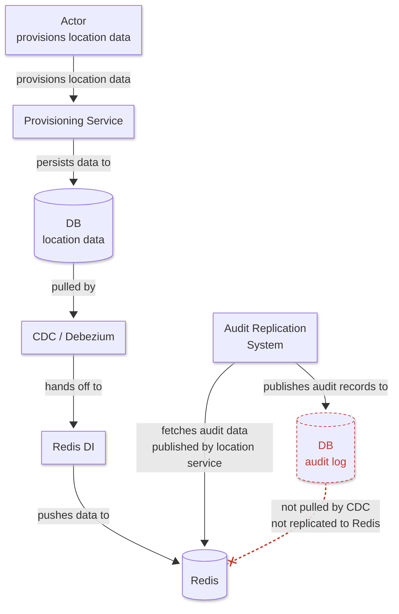
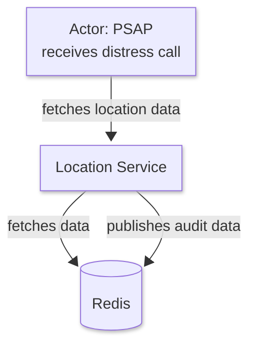
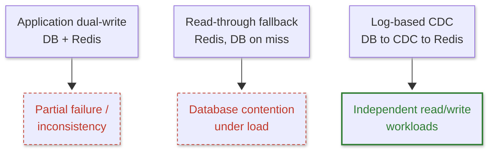
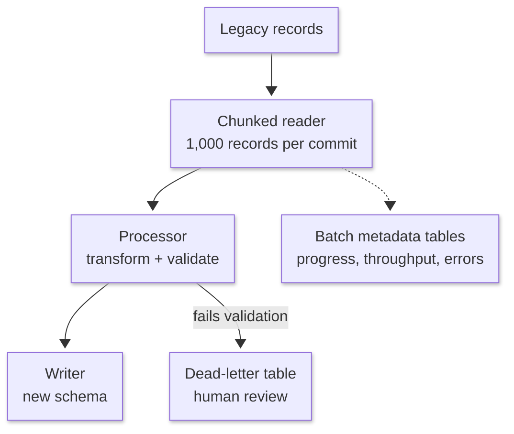

Emergency location delivery has an unusual architectural constraint: the workload that writes location data is not the workload that serves it. Provisioning is transactional, validation-heavy, and bursty. Location delivery must stay predictable and low-latency the moment an emergency lookup arrives. Putting both workloads behind the same database creates a coupling that is difficult to reason about under load, and a write-heavy provisioning spike can degrade the read path exactly when it cannot afford to.

This post is written for **engineers and engineering managers** building latency-sensitive, regulated systems. As part of an NG911 (Next-Generation 911) platform initiative at a major telecommunications provider, I took technical ownership across the provisioning and location-delivery paths and helped shape an architecture that separates them using log-based change data capture (CDC), while still meeting NENA i3 (HELD, PIDF-LO) and FCC compliance requirements.

> **Note:** This post describes the architecture and engineering practices behind an NG911 platform initiative, generalized and with the employer and internal program name anonymized. The legacy data migration discussed below is in preparation. It has not yet run in production.

---

## TL;DR

- Provisioning (writes) and location delivery (reads) are separated into independent paths, synchronized through change data capture (CDC) instead of application-level dual writes.
- Performance testing has demonstrated p95 lookup latency under 100 ms at the location service's own boundary.
- A Spring Batch migration tool for millions of legacy location records has been built and validated through dry runs; the production migration itself has not started, and the validation strategy behind it matters more than the batch job.

---

## System at a Glance

| Aspect | Detail |
|---|---|
| Compliance requirements | NENA i3 (HELD, PIDF-LO), FCC mandates |
| Read path latency target | p95 under 100 ms, measured at the location service boundary |
| Migration scope | Millions of legacy location records, not yet migrated |
| Team | A small cross-functional engineering and QA group spanning both the provisioning and location-delivery paths |

---

## Consolidating Ownership Across the Write and Read Paths

I joined the initiative as a technical leader focused on the location-delivery read path: the APIs that serve downstream VoIP routing networks during an active emergency call. A sibling team owned the provisioning write path, the system that validates and persists device and tower location data.

A few months in, leadership asked me to take broader technical ownership across both the provisioning and location-delivery paths, given upcoming FCC compliance deadlines and the need for one coherent architectural roadmap. I now direct a small cross-functional engineering and QA team spanning both paths.

The consolidation removed a coordination cost that had been slowing both teams down. With one team owning both sides of the boundary, we could align API contracts, unify testing governance, and commit to a single architectural direction instead of negotiating one across a team boundary. The delivery timeline moved forward as a result, rather than stalling during the transition.

---

## The Architectural Core: Separating Writes from Reads

In emergency response, a spike in write-heavy location provisioning must never degrade read performance during an active 911 lookup. The two workloads have fundamentally different requirements: provisioning needs strict transactional consistency and auditability, and lookup needs to be fast and available under load. These requirements do not coexist well on shared infrastructure, so the platform separates them.

Redis is the serving boundary between the two paths below: the provisioning path updates the database, CDC propagates those changes into Redis, and the location service reads from Redis.

**Thesis:** the transactional system owns persistence and consistency, the location service owns low-latency serving, and CDC connects the two without introducing application-level dual writes. A separate audit-replication loop feeds Redis-side audit data back into the database, so the compliance record of what was served is durable even though the read path itself never writes to the database directly.

### Provisioning (write path)

- The actor initiating provisioning (a device or tower data source) calls the provisioning service, which validates and persists the data to the relational database, the durable, transactional source of truth.
- CDC (Debezium) pulls changes from the database, and Redis DI (Redis Data Integrator) pushes the resulting data into the Redis serving model, keeping the write path free of any direct write to Redis.
- An audit replication system fetches the audit data the location service publishes into Redis and writes it back to the database, so audit history is durable in the same database used for provisioning data.
- The audit log table is a one-way sink, not a source for CDC. Audit records that land in the database through this loop are never pulled back out by CDC and never reach Redis; only the provisioning table feeds the serving cache. The dashed line in the diagram marks that boundary explicitly, since it is the one place in the architecture where "written to the database" does not imply "eventually in Redis."

### Location delivery (read path)

- High-throughput, low-latency REST APIs consumed by VoIP service teams during active 911 routing. The initiating actor here is the PSAP (Public Safety Answering Point), fetching location data from the location service upon receiving a call from a distressed caller.
- The location service fetches data exclusively from Redis, never from the database directly, and publishes audit data back into Redis for the audit-replication loop to pick up.
- Performance testing has shown p95 latency under 100 ms, measured at the location service's own boundary: the time the service takes to answer a PSAP lookup, not the end-to-end latency of a 911 call.

### Decision: synchronizing the two paths

**Options considered:**

1. Synchronous dual writes from the application layer to both the database and Redis on every provisioning request.
2. Synchronous read-through, where the location service reads from Redis and falls back to the database on a cache miss.
3. Asynchronous change data capture, reading mutations directly off the database's redo logs and propagating them to Redis out of band.

**Tradeoffs:**

- Dual writes introduce a partial-failure mode: the database write can succeed while the cache write fails, or the reverse, leaving the two systems inconsistent with no single source of truth for which one is correct. It also adds a network hop, and its latency, to every provisioning request.
- Read-through with a database fallback keeps a single write path, but a cache miss during a provisioning spike pushes read traffic onto the same database that is absorbing the write spike, which is unacceptable during an active emergency-call surge.
- Asynchronous CDC decouples the two paths entirely and removes the dual-write failure mode, but it introduces replication lag as a new failure mode that has to be monitored explicitly.

**Decision:** asynchronous CDC, reading mutations from the database redo logs.

**Implication:** replication lag becomes a first-class metric with its own monitoring and alerting. It also means the validation strategy for any bulk operation against the database, including the migration described below, has to explicitly verify that changes have propagated to Redis, not only that they landed in the database.

### Change data capture: Debezium today, RDI under evaluation

| Aspect | Before: Debezium (current production) | After: Redis Data Integrator, RDI (in evaluation) |
|---|---|---|
| Change capture mechanism | Log-based connector translating database changes into events consumed by a downstream sync process | Log-level mapping directly from relational tables to Redis data structures |
| Intermediate hops | Connector plus a downstream consumer/transform step | Fewer intermediate hops between the redo log and Redis |
| Sync latency | Current production baseline | Expected improvement; not yet finalized |

**Options considered:** remain on Debezium, adopt RDI, or build a custom log-tailing service.

**Tradeoffs:** the table above covers the mechanism difference; the open question is risk. RDI's potential latency improvement still needs to be demonstrated under representative production workloads, and it is newer in our environment and less proven at our scale than Debezium. A custom log-tailing service was ruled out early: it would offer the most control but the highest engineering and operational cost to build and maintain.

**Decision:** evaluate and migrate toward RDI, with Debezium remaining in production until that evaluation is complete.

**Implication:** RDI's replication semantics must be validated against Debezium's before full cutover. This is a direct instance of the same principle behind the migration's replication-validation layer, described next: verifying that a change downstream matches what was written upstream, not just that it arrived.

---

## Preparing to Migrate Millions of Legacy Records

The architecture above solves synchronization for new data. Millions of legacy location records still sit in the old schema and need to move into the new one, without corrupting data or degrading the service that depends on it.

Running ad hoc update scripts against a production database subject to strict compliance requirements was never an option. Instead, I designed a standalone Java command-line migration utility built on Spring Batch:

The tool processes legacy records in transaction-bounded chunks of 1,000. A record that fails validation is routed to a dead-letter table for human review instead of halting the entire run, and batch metadata tables expose step-level progress, throughput, and error metrics in real time.

This tool has been validated through repeated dry runs. The production migration itself has not started.

### What dry runs have surfaced

Dry runs exposed a class of errors that row-count reconciliation alone could never detect. No production incident exists to report here, because the migration has not touched production; what dry runs did expose is worth documenting anyway. The migration logic assumed a one-to-one mapping between a legacy field and a field in the new schema, and that assumption did not hold for every table. Some legacy fields required a business rule to disambiguate correctly against the new schema. Record counts matched in every one of those cases; the values did not. That gap is exactly why the validation strategy below does not stop at counting rows.

### Why the validation strategy matters more than the batch job

A batch job reaching 100% completion demonstrates almost nothing on its own. Moving rows is easy. Proving that the right rows moved, in the right shape, and that systems downstream of the migration behave correctly afterward, is hard. The validation plan has five layers:

| # | Validation layer | What it catches |
|---|---|---|
| 1 | Source/destination record-count reconciliation | Missing or duplicated rows between source and destination |
| 2 | Field-level validation | Silent transformation bugs where a value changes incorrectly in type or content |
| 3 | Business-rule validation | Domain constraints the compliance schema requires, which a raw diff would not catch |
| 4 | Replication validation | Confirms migrated records propagate through CDC into Redis and that the Redis representation matches the expected location data |
| 5 | Post-migration sampling | Targeted review of a representative sample, catching systematic errors the automated layers miss |

Replication validation is the layer most worth calling out. It validates the entire downstream path, not the database migration in isolation. A record can migrate perfectly into the new schema and still be wrong if it does not show up correctly in the cache the location service actually reads from.

**A successful migration is not demonstrated by a job reaching 100% completion. It is demonstrated by independent reconciliation of the resulting data and downstream behavior.**

---

## Production and Operations

- **Deployment strategy.** The migration will run batch by batch rather than as a single cutover. Each batch runs through all five validation layers before the next batch starts, and the run can pause between batches if validation surfaces a problem.
- **Rollback approach.** The migration is designed to be forward-safe rather than dependent on a database-wide rollback. It is additive: it writes into the new schema without deleting legacy data, and legacy data remains authoritative until validation establishes that the corresponding new records and downstream Redis state are correct. Any record that fails validation sits in the dead-letter table for review rather than silently succeeding or blocking the rest of the run.
- **Observability.** Spring Batch's metadata tables expose step-level progress, throughput, and error metrics in real time. CDC replication lag is monitored as its own metric, per the synchronization decision above.
- **Cost.** Running a full duplicate serving layer, the Redis tier plus the CDC pipeline alongside the relational database, is a real infrastructure cost, not just an engineering one. It is the direct tradeoff for keeping the read path isolated from provisioning load.

---

## Anti-Patterns

- Do not run ad hoc or manual update scripts directly against a production database subject to strict compliance requirements.
- Do not treat batch-job completion as proof of a correct migration. Completion is necessary but not sufficient.
- Do not perform application-level dual writes to keep a cache synchronized with a system of record. It introduces a partial-failure mode that log-based CDC avoids entirely.
- Do not stop validation at record counts. Counts can match while individual records are wrong, and only field-level, business-rule, and replication validation will catch that.

---

## Key Takeaways

1. **Separate the write and read paths when their consistency and latency requirements conflict.** Provisioning needs strict transactional consistency; location delivery needs to stay fast under load. Sharing infrastructure between the two means one workload's spike degrades the other's guarantees.

2. **Prefer log-based CDC over application-level dual writes when synchronizing a system of record with a serving cache.** Dual writes create a partial-failure mode with no single source of truth for which write actually landed. CDC removes that failure mode by making the database the only write path and propagating changes out of band.

3. **Build the migration's validation strategy before the migration itself.** Completion percentage is not correctness. Independent reconciliation across record-count, field-level, business-rule, and downstream-replication layers is what actually proves the data can be trusted.

4. **Consolidate ownership when a team boundary becomes a coordination cost.** Aligning API contracts and testing governance under one accountable owner removed the negotiation overhead between two teams and moved the delivery timeline forward instead of stalling it.

---

The migration is still ahead of us. When it runs in production, I will follow up with the results, particularly which validation layers caught issues that the others did not.

For related work, see [Projects](/projects/).
