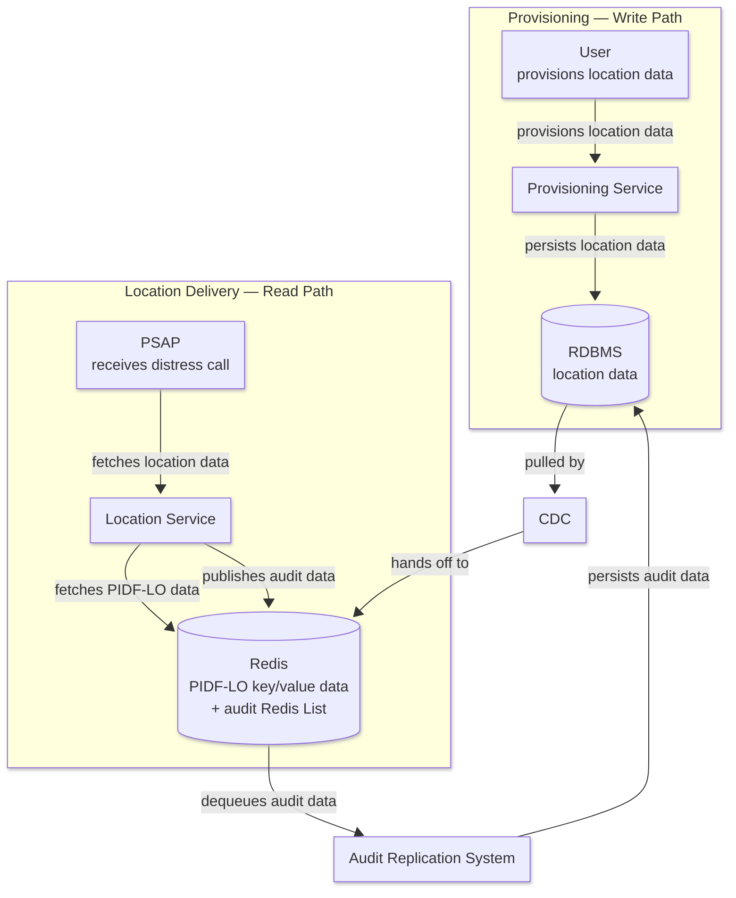
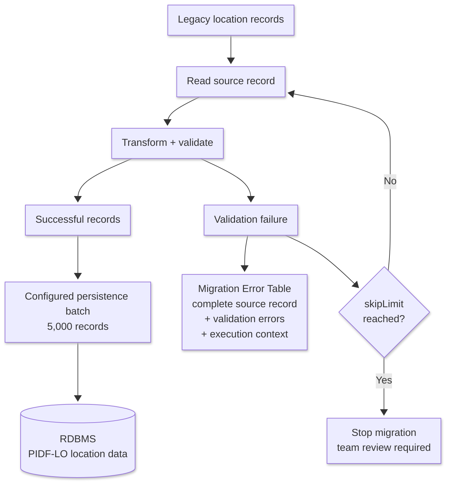

Emergency location delivery has an unusual architectural constraint: the workload that writes location data is not the workload that serves it. Provisioning is transactional, validation-heavy, and bursty. Location delivery must stay predictable and low-latency when an emergency lookup arrives.

Putting both workloads behind the same database creates coupling that is difficult to reason about under load. A write-heavy provisioning spike can degrade the read path exactly when it cannot afford to.

This post is written for **engineers and engineering managers** building latency-sensitive, regulated systems. As part of an NG911 (Next-Generation 911) platform initiative at a major telecommunications provider, I took technical ownership across the provisioning and location-delivery paths and helped shape an architecture that separates them using change data capture (CDC), while supporting NENA i3 (HELD, PIDF-LO) and applicable regulatory requirements.

> **Note:** This post describes the architecture and engineering practices behind an NG911 platform initiative, generalized and with the employer and internal program name anonymized. The legacy data migration discussed below is in preparation. It has not yet run in production.

---

## TL;DR

- Provisioning and location delivery are separated into independent write and read paths: the RDBMS stays the durable system of record, CDC propagates PIDF-LO data into Redis, and lookups hit p95 latency under 100 ms at the Location Service boundary.
- Audit is decoupled from the location-delivery request too — the Location Service publishes to a Redis List, and a separate Audit Replication System persists those records back to the RDBMS asynchronously.
- A Spring Batch tool performs a one-time seed of millions of legacy location records into the PIDF-LO model, validated record by record with a `skipLimit` safety gate and a migration error table for offline investigation; it never writes to Redis directly.

---

## System at a Glance

| Aspect | Detail |
|---|---|
| Compliance requirements | NENA i3 (HELD, PIDF-LO) and applicable regulatory requirements |
| Read path latency target | p95 under 100 ms, measured at the Location Service boundary |
| Migration scope | Millions of legacy location records, not yet migrated |
| Migration purpose | One-time seeding of legacy location data into the PIDF-LO RDBMS model |
| Migration batch size | Configurable; 5,000 records used as the example configuration here |
| Serving model | PIDF-LO location data replicated from the RDBMS into Redis |
| Audit model | Location Service → Redis List → Audit Replication System → RDBMS |

---

## Consolidating Ownership Across the Write and Read Paths

I joined the initiative as a technical leader focused on the location-delivery read path: the APIs that serve downstream VoIP routing networks during an active emergency call. A sibling team owned the provisioning write path, the system that validates and persists location data.

A few months in, leadership asked me to take broader technical ownership across both the provisioning and location-delivery paths, given upcoming compliance deadlines and the need for one coherent architectural roadmap. I now direct a small cross-functional engineering and QA team spanning both paths.

The consolidation removed a coordination cost that had been slowing both teams down. With one team owning both sides of the boundary, we could align API contracts, unify testing governance, and commit to a single architectural direction instead of negotiating one across a team boundary.

---

## The Architectural Core: Separating Writes from Reads

In emergency response, a spike in write-heavy location provisioning must not degrade read performance during an active 911 lookup.

The two workloads have fundamentally different requirements:

- **Provisioning** needs transactional consistency, validation, and durable persistence.
- **Location delivery** needs predictable, low-latency reads.
- **Audit replication** needs a durable path for recording what the Location Service served without making the real-time request dependent on a database write.

The platform therefore separates the write and read paths while maintaining a clear ownership boundary:

- The **Provisioning Service owns the RDBMS write path**.
- The **Location Service owns the Redis serving path**.
- **CDC** connects the RDBMS to Redis for location-data replication.
- The **Audit Replication System** moves audit records from the Redis List back into the RDBMS.

The same Redis instance supports two distinct logical data flows:

1. **Redis key/value data** contains replicated PIDF-LO location data used by the Location Service.
2. **A Redis List** contains audit records published by the Location Service and consumed by the Audit Replication System.

These are different uses of the same Redis infrastructure; they should not be interpreted as the same data structure or processing path.

### Unified architecture



The important architectural boundary is that the RDBMS and Redis are not application-level dual-write targets.

The Provisioning Service writes location data only to the RDBMS. CDC observes those database changes and propagates the resulting PIDF-LO data into Redis.

The Location Service reads location data from Redis. It does not query the RDBMS as part of the normal location-delivery path.

For audit, the Location Service publishes an audit record to the Redis List. The Audit Replication System dequeues those records and persists them to the RDBMS. This gives the platform durable audit history without adding an RDBMS write to the critical location-delivery request.

---

## Provisioning: The Write Path

The provisioning path is responsible for validating and durably persisting location data.

```text
User
  │
  │ provisions location data
  ▼
Provisioning Service
  │
  │ persists location data
  ▼
RDBMS
```

The RDBMS is the durable source of truth for provisioned location data.

Once location data is persisted, the application does not perform a second write to Redis. Instead, the database change becomes the input to the CDC path:

```text
RDBMS
  │
  │ CDC
  ▼
Redis
```

This keeps the application write path simple and avoids making a successful provisioning request dependent on two independent persistence operations.

---

## Location Delivery: The Read Path

The location-delivery path is optimized for predictable, low-latency reads. The initiating actor is the PSAP (Public Safety Answering Point), which fetches location data from the Location Service upon receiving a call from a distressed caller.

```text
PSAP
  │
  │ fetches location data
  ▼
Location Service
  │
  │ fetches PIDF-LO data
  ▼
Redis
```

The Location Service reads the PIDF-LO representation from Redis rather than querying the RDBMS.

In parallel with serving the location response, the Location Service publishes an audit record to the Redis List:

```text
Location Service
       │
       │ publishes audit data
       ▼
  Redis List
```

The audit publication is intentionally separate from the location lookup itself. The Location Service does not synchronously persist the audit record to the RDBMS during the emergency lookup.

---

## Audit Replication: Returning Durability to the RDBMS

Audit records have a different lifecycle from location data.

The Location Service publishes audit records to a Redis List. The Audit Replication System continuously dequeues those records and persists them to the RDBMS:

```text
Redis List
    │
    │ dequeues audit data
    ▼
Audit Replication System
    │
    │ persists audit data
    ▼
RDBMS
```

The RDBMS therefore remains the durable destination for audit history, while Redis provides the decoupling needed to keep the location-delivery request path independent of database write latency.

This is also why the distinction between Redis's two logical uses matters:

| Redis data | Producer | Consumer | Purpose |
|---|---|---|---|
| PIDF-LO key/value data | CDC | Location Service | Low-latency location lookup |
| Redis List | Location Service | Audit Replication System | Asynchronous audit persistence |

Both use the same Redis instance, but they represent different flows with different producers, consumers, and operational concerns.

---

## Preparing to Migrate Legacy Location Data

The steady-state architecture solves synchronization for newly provisioned data. A separate problem remains: millions of existing legacy location records need to be converted into the new PIDF-LO representation and seeded into the RDBMS.

The migration is a **one-time seeding tool**.

Its responsibility is deliberately narrow:

```text
Legacy location data
        │
        ▼
Transform + validate
        │
        ▼
PIDF-LO records in RDBMS
        │
        ▼
Existing CDC path
        │
        ▼
Redis
```

The migration does **not** contain a separate Redis-writing mechanism.

Once a successfully migrated PIDF-LO record is persisted to the RDBMS, it enters the same downstream replication path used by normally provisioned data.

That gives the platform one synchronization mechanism rather than creating separate rules for migrated and newly provisioned records.

---

## Migration Processing and Validation

The migration is implemented as a standalone Java command-line utility using Spring Batch.

Validation occurs at the **individual record level**.

For each legacy record, the migration:

1. Reads the source record.
2. Transforms it into the target PIDF-LO representation.
3. Applies the required validation rules.
4. Routes successful records into the current persistence batch.
5. Routes failed records into the migration error table.

The successful-record batch size is configurable. The migration was tested at batch sizes above 15,000 records; **5,000 records is used as the representative configuration in this article** because it provides a practical balance between database throughput, transaction size, and operational control.

### Successful records

Successful records are accumulated into the configured batch and persisted to the PIDF-LO RDBMS table.

```text
Record 1 ──┐
Record 2 ──┤
Record 3 ──┤
    ...    ├──> 5,000-record batch ──> RDBMS
Record N ──┘
```

The batch size is an implementation and operational tuning parameter, not an architectural requirement.

### Failed records

A record that fails validation is not silently discarded and does not disappear into a generic job error log.

The complete source record and the validation errors encountered for that record are persisted to a dedicated **migration error table**.

The purpose is to provide enough context for a team member to investigate the failure offline without reconstructing the migration environment.

Investigation context can include:

- the original source record;
- all validation errors encountered;
- source line number;
- source filename;
- migration timestamp;
- migration run identifier;
- host machine;
- user who ran the migration; and
- other execution metadata required for traceability.

The migration error table is therefore an operational investigation record, not merely a failure counter.

---

## `skipLimit` as a Migration Safety Gate

Individual validation failures do not necessarily mean that the entire source dataset is unsafe to migrate.

A small number of malformed or non-conforming records can be isolated, persisted to the migration error table, and reviewed independently while processing continues.

The migration therefore uses Spring Batch's `skipLimit` as an explicit **safety gate**.

The configured limit represents the maximum number of validation failures that can be tolerated during a migration run.

The behavior is:

- **Below the skip limit:** validation failures are captured in the migration error table and processing continues.
- **At the skip limit:** the migration stops gracefully.
- **After the migration stops:** the team reviews the input data and migration behavior before deciding whether processing should continue.

The purpose is not merely to prevent a batch job from failing. It is to prevent a potentially systemic problem in the source data or transformation rules from producing a large population of questionable target records.

The `skipLimit` therefore becomes a **migration gate** between normal record-level exceptions and a condition that requires human review.

---

## Migration Flow

The one-time migration can be summarized as follows:



The diagram intentionally stops the migration flow at the RDBMS.

The downstream path is the existing platform architecture:

```text
RDBMS → CDC → Redis
```

This is important because the migration should not become a special-purpose integration mechanism.

---

## What Dry Runs Have Surfaced

Dry runs exposed a class of errors that record-count reconciliation alone could never detect. No production incident exists to report here, because the migration has not touched production; what dry runs did expose is worth documenting anyway.

The transform-and-validate logic assumed a one-to-one mapping between a legacy field and a field in the PIDF-LO representation, and that assumption did not hold for every source table. Some legacy fields required a business rule to disambiguate correctly against the new schema. Record counts matched in every one of those cases; the field values did not.

That gap is exactly why validation happens at the record level rather than stopping at a population count, and why the migration error table captures the full source record and validation errors rather than a bare failure tally.

---

## Validating the Migration Beyond Job Completion

A migration job reaching 100% completion demonstrates that the processing pipeline completed. It does not demonstrate that the resulting location data is correct or that downstream systems contain the expected representation.

The validation strategy therefore has two distinct phases.

### During migration

#### 1. Record-level transformation and validation

Every source record is transformed into the target PIDF-LO representation and validated before it is considered successful.

#### 2. Migration error capture

Failed records are written to the migration error table with the source record, validation errors, and execution context needed for offline investigation.

#### 3. `skipLimit` safety gate

The configured `skipLimit` prevents the migration from continuing when validation failures reach a level that suggests the input data or transformation rules require team review.

#### 4. Controlled batch persistence

Successful records are accumulated into configurable persistence batches. The representative configuration described here is 5,000 records per batch.

### Migration verification

After and alongside the migration, independent verification validates the resulting system state.

#### 5. Source/destination reconciliation

The migrated population is reconciled against the source to identify missing or unexpected records.

#### 6. Field-level validation

Target PIDF-LO values are compared with the expected transformed representation to identify silent transformation errors.

#### 7. Business-rule validation

Domain-specific rules are validated independently of simple field comparison.

#### 8. Downstream replication validation

The migration verifies that successfully persisted PIDF-LO records propagate through the existing CDC path into Redis and that the resulting Redis representation contains the expected location data.

#### 9. Post-migration sampling

A targeted sample provides an additional independent check for systematic issues that automated validation may not detect.

A record can be correctly transformed and persisted to the RDBMS while still failing to appear correctly in Redis. Conversely, record counts can match while individual field values are wrong.

A successful migration therefore means more than completing the batch job.

It means demonstrating that the intended data was:

**transformed correctly → persisted correctly → replicated correctly → available in the serving representation**

---

## What the Migration Is—and Is Not

It is useful to be explicit about the boundary.

### The migration is

- a one-time data-seeding tool;
- a legacy-to-PIDF-LO transformation process;
- a record-level validation process;
- a controlled batch persistence process;
- an operationally traceable process through the migration error table;
- protected by a configurable `skipLimit` safety gate.

### The migration is not

- a permanent synchronization service;
- a second Redis population mechanism;
- an application-level database/cache dual writer;
- a replacement for CDC;
- a reason to create a special downstream serving path.

That separation keeps the migration aligned with the steady-state architecture rather than introducing a parallel architecture that would eventually need to be maintained.

---

## Production and Operations

### Deployment strategy

The migration will run as a controlled batch process rather than as a single database-wide cutover.

The configurable batch size allows the team to tune throughput while keeping persistence transactions operationally manageable. The 5,000-record configuration used in this article is representative rather than mandatory.

Record-level failures do not automatically invalidate the entire input population. They are persisted with complete investigation context. However, reaching the configured `skipLimit` stops the migration and turns the run into a review point.

### Rollback approach

The migration is designed to be forward-safe rather than dependent on a database-wide rollback.

It seeds the new PIDF-LO model without requiring the legacy source data to be deleted as part of the migration. This preserves the ability to reconcile source and target data and investigate discrepancies.

The migration error table also provides a durable record of records that could not be safely transformed or validated.

### Observability

Operational visibility needs to cover both the migration and the downstream architecture.

For the migration:

- records processed;
- records successfully transformed;
- records rejected;
- migration-error records;
- current batch;
- batch throughput;
- current run identifier;
- `skipLimit` consumption.

For the serving architecture:

- CDC replication lag;
- Redis availability;
- Location Service latency;
- Location Service error rates;
- audit queue/list depth;
- audit replication throughput and failures.

A completed migration with a healthy-looking job metric is not enough if downstream replication is stalled.

---

## Anti-Patterns

### Ad hoc production update scripts

Do not run manual transformation scripts directly against production data when the migration requires traceability, repeatability, validation, and controlled failure handling.

### Treating completion as correctness

A migration reaching 100% completion demonstrates that the job finished. It does not demonstrate that the data is correct.

### Application-level dual writes

Do not make the Provisioning Service responsible for independently writing location data to both the RDBMS and Redis.

That creates a partial-failure mode and couples the transactional write path to the serving layer.

### Using the database as a read-path fallback

Do not make the Location Service routinely fall back to the RDBMS on Redis misses if the goal is to isolate location delivery from provisioning load.

### Counting rows without validating values

Record counts can match while values are incorrect. Field-level, business-rule, and downstream replication validation are necessary.

### Treating migration as a second synchronization system

The migration should seed the RDBMS and stop there. Once data is persisted, the existing CDC mechanism should handle replication into Redis.

---

## Key Takeaways

1. **Separate the write and read paths when their consistency and latency requirements conflict.** Provisioning needs transactional consistency and durable persistence; location delivery needs predictable, low-latency reads.

2. **Keep the RDBMS as the durable source of truth and use CDC to populate the serving model.** The Provisioning Service writes location data to the RDBMS; it does not perform an application-level dual write to Redis.

3. **Use one Redis infrastructure boundary for different logical workloads when their responsibilities are clear.** PIDF-LO location data is stored in Redis key/value data for serving, while audit records are published to a Redis List for asynchronous persistence.

4. **Treat migration as a one-time seed, not a second synchronization architecture.** Legacy records are transformed and validated into the PIDF-LO RDBMS model, after which the normal RDBMS → CDC → Redis path takes over.

5. **Validate individual records and preserve the evidence needed to investigate failures.** A migration error table containing the complete source record, validation errors, and execution context turns failed records into actionable investigation cases.

6. **Use `skipLimit` as a migration safety gate.** A limited number of bad records can be isolated; reaching the configured threshold is a signal that the input or transformation process requires team review.

7. **Prove the migration beyond job completion.** Source reconciliation, field-level validation, business-rule validation, downstream replication validation, and targeted sampling provide evidence that the data is correct from source through serving.

8. **Make replication lag a first-class operational concern.** CDC decouples the write and read paths, but that decoupling introduces asynchronous propagation and therefore a measurable consistency window.

---

The migration is still ahead of us. When it runs in production, I will follow up with the results, particularly which validation layers caught issues that the others did not.

For related work, see [Projects](/projects/).
