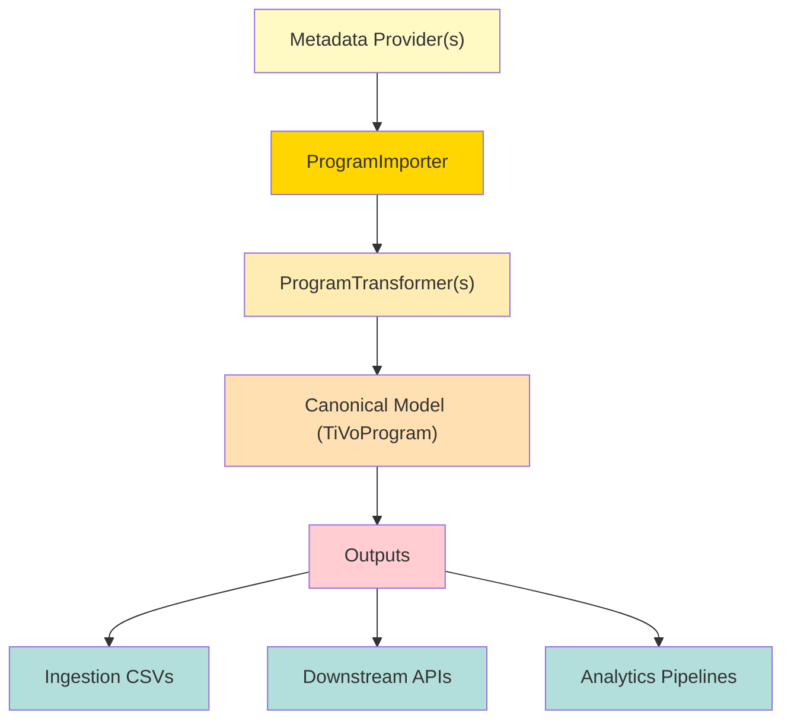
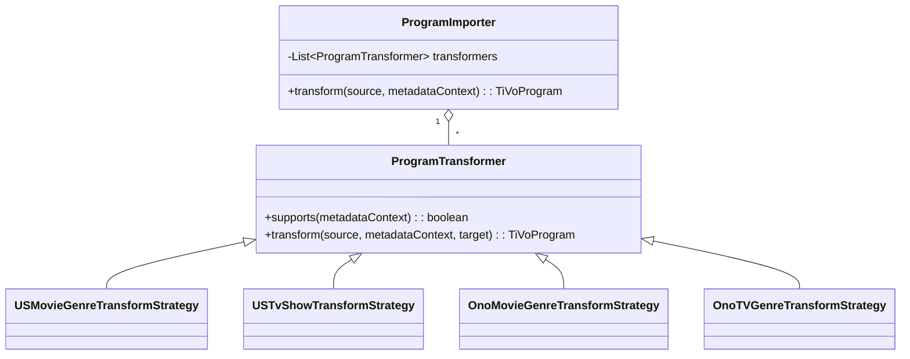
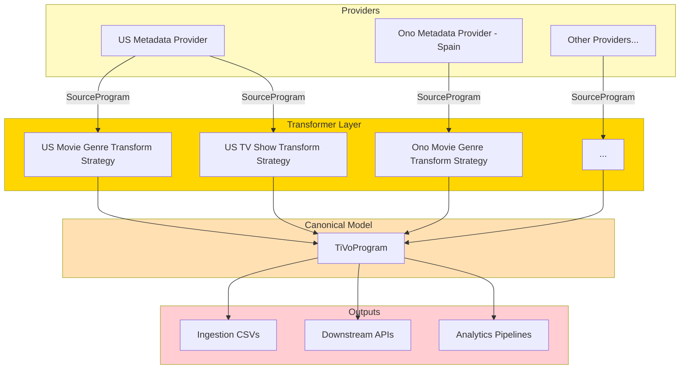
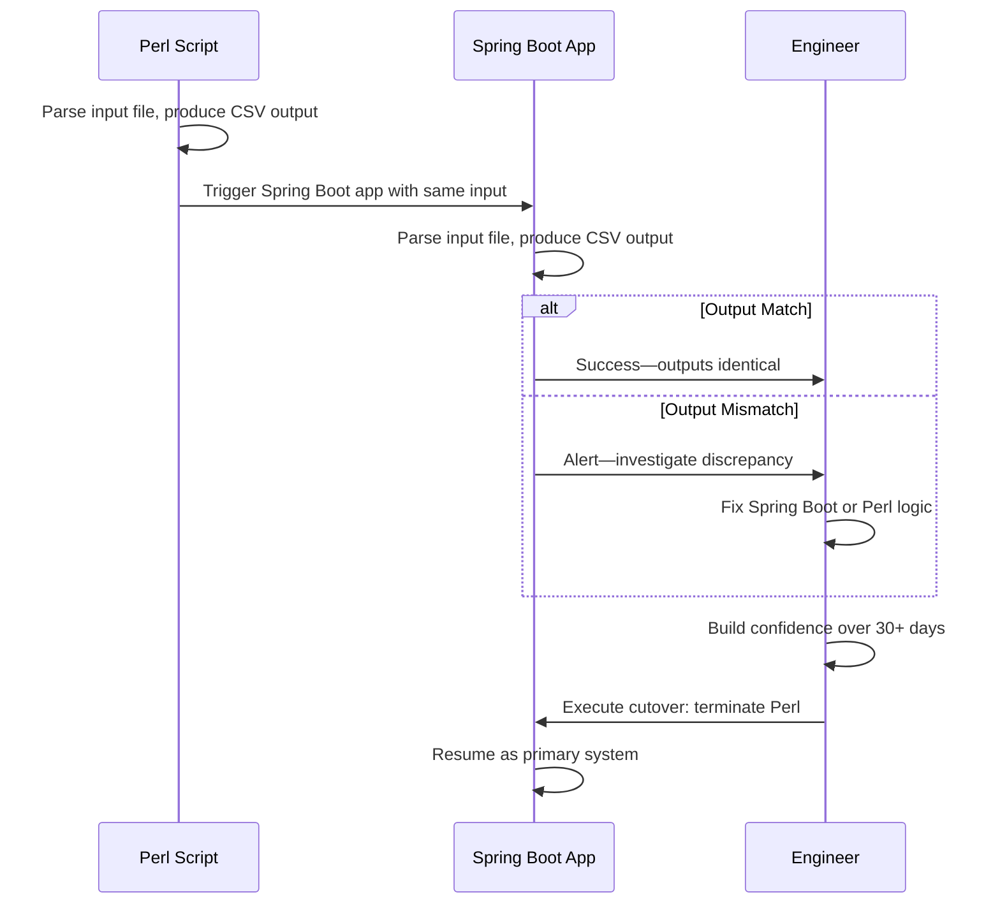

At TiVo in 2010–2012, our metadata ingestion pipeline was a single Perl script: 5,000 lines, no tests, no documentation. A small team maintained it while it processed roughly **3 million records per day** across about a dozen metadata providers. The daily ingest run took the better part of **4 hours** and had to be scheduled in the early morning—any failure meant bad data for millions of users with no safe way to re-run during the day. When the business prioritized expansion into European and Latin American markets, the script could not accommodate new providers without weeks of risky retrofitting. The decision was made to replace it — not in one drop, but component by component behind a parallel shadow run.

This post is for **engineers and engineering managers** working on legacy modernization. Engineers will find the architecture and migration patterns directly applicable. Managers will find the decision framework and business case useful for building alignment.

> **Note:** The challenges and solutions described here reflect TiVo's metadata ingestion pipeline from over a decade ago. The current architecture has evolved significantly since then.

---

## TL;DR

- A 5,000-line Perl monolith was replaced with a Spring Batch pipeline in under 3 months, cutting the daily ingest run from roughly **4 hours to under an hour**.
- The strategy pattern eliminated monolithic if-else logic, enabling new provider onboarding in **days instead of weeks**.
- A parallel shadow-mode run built confidence before cutover and surfaced **dozens of long-standing production bugs**.

---

## The Problem: A Metadata Pipeline on the Brink

Beneath TiVo's celebrated user experience sat a technical relic: a single Perl script transforming raw provider feeds into the listings, search, and recommendations the platform ran on. It wasn't just legacy code—it was a daily source of anxiety for engineers and the business alike.


### Why was this script so infamous?

- **Opaque Complexity:** With logic buried in layers of nested if-else statements, understanding the script meant decoding years of undocumented tribal knowledge. Even seasoned engineers needed days to trace simple data flows or debug errors.
- **Reactive Firefighting:** When a metadata provider changed a field or format, we often learned about it the hard way—from customer complaints. The lack of proactive error detection meant we were always a step behind, scrambling to patch production issues.
- **Manual, Fragile Testing:** Every update, no matter how minor, demanded a full-scale run of the entire pipeline on dedicated VM servers. Engineers spent hours validating outputs—time that could have been better spent building features or improving reliability.
- **Scalability Dead-ends:** Designed for in-memory processing, the script could only be scaled vertically by throwing more hardware at a single server. As our markets and data volumes grew, so did the risk of outages and slowdowns.
- **Blocked Growth:** Expanding into Europe was a business imperative, yet each new provider required painstaking retrofits, risking downtime and derailing timelines. The rigidity of the script repeatedly turned opportunity into risk.

### A real-world example

When Gracenote (our US metadata provider) silently altered their genre codes, our pipeline processed their files without complaint, but downstream recommendations became garbled. It took weeks of detective work to uncover the root cause, fix the script, and restore data quality. Meanwhile, expansion plans suffered.

The Perl script did not only slow us down; it was a ticking time bomb threatening reliability and innovation. If TiVo wanted to expand globally, we needed a system that was **flexible, testable, and scalable by design**.

## Decision: Why Spring Batch

**Options evaluated:**

| Option                  | Description                                                                                 | Why Rejected / Selected                                                                         |
| ----------------------- | ------------------------------------------------------------------------------------------- | ------------------------------------------------------------------------------------------------ |
| Rewrite Perl with tests | Add test coverage to the existing script                                                    | Perl tooling is limited; the monolithic in-memory architecture would remain; harder to hire for |
| Pure Spring (no Batch)  | Java application without a batch framework                                                  | No built-in job management, restartability, or chunk processing                                 |
| **Spring Batch**        | Java batch framework with transaction management, restartability, and step-based processing | **Selected** — provides the right abstractions for high-volume, multi-step ingest pipelines     |

Spring Batch was not free: it cost us a framework learning curve, a more verbose language, and real infrastructure we had not needed before. We went in with those costs priced in — [what they actually amounted to](#what-we-lost-the-tradeoffs) is covered at the end of this post.

**Long-term implication:** Accepting those upfront costs gave the team a framework that could scale horizontally, be tested in isolation, and onboard new providers by composing existing classes rather than editing a shared monolith.

_Figure: The new ingestion pipeline—modular, provider-agnostic, and scalable._



The goals were:

1. **Introduce unit and end-to-end testing** to prevent regressions and surface bugs before production.
2. **Break down complexity** into modular, independently testable components.
3. **Enable rapid provider onboarding** without modifying the core pipeline.
4. **Enable horizontal scaling** beyond the limitations of single-instance, in-memory processing.

Building on this foundation, we implemented a strategy-based pipeline.

## The New Architecture: A Strategy-Based Pipeline

Our solution leveraged the power of **Spring Batch** to create a highly configurable and testable ingestion pipeline. The most significant architectural change was the complete elimination of the monolithic `if-else` logic in favor of a **strategy pattern**.

_Figure: The strategy pattern enables pluggable, provider-specific transformations via modular ProgramTransformer classes._


### Strategy Interface

We introduced a **strategy interface** that transformed metadata provider inputs into TiVo's canonical format:

```java
interface ProgramTransformer<T extends SourceProgram> {
    /**
     * Determines whether this strategy supports the given source.
     *
     * @param metadataContext Contextual information about the metadata provider
     * @return {@code true} if this instance is capable of transforming this source metadata
     */
    boolean supports(MetadataContext metadataContext);

    /**
     * Applies this strategy's slice of the transformation on top of the canonical
     * program produced by earlier strategies in the chain.
     *
     * @param source Instance of the source metadata to be transformed
     * @param metadataContext Contextual information about the metadata provider
     * @param target The canonical program accumulated so far, or {@code null} for the first strategy in the chain
     * @return A canonical representation of the source metadata
     */
    TiVoProgram transform(T source, MetadataContext metadataContext, TiVoProgram target);
}
```

Here's how it worked:

- `SourceProgram` represents the common denominator for program metadata, whether a TV show or a movie.
- Each implementation of `ProgramTransformer` handled provider-specific transformations, mapping raw metadata into TiVo's `TiVoProgram` model.
- Example strategies included:
  - `USMovieGenreTransformStrategy` - transforms US movie genre details.
  - `USTvShowTransformStrategy` - transforms US TV show genre details.
  - `OnoMovieGenreTransformStrategy` (for a Spanish metadata provider called Ono)
  - `OnoTVGenreTransformStrategy` (for a Spanish metadata provider called Ono)
  - Many more others. Too many to mention here.

The strategy pattern was also used to **validate** metadata, not just transform it.

### Strategy Chains

Once we had the `ProgramTransformer` interface, assembling provider-specific pipelines became straightforward. For example, a US metadata provider might require a chain of transformers for TV shows, while a European provider like Ono required a slightly different chain for movies.

A `ProgramImporter` class was introduced to encapsulate the logic of importing metadata from a specific metadata provider:

```java
abstract class ProgramImporter<T extends SourceProgram> {
    private final List<ProgramTransformer<T>> transformers;
    ...

    /**
     * Determines whether this importer supports the given source.
     *
     * @param metadataContext Contextual information about the metadata provider
     * @return {@code true} if this importer supports the given source
     */
    public abstract boolean supports(MetadataContext metadataContext);

    /**
     * Runs the configured chain of transformers, each one enriching the canonical
     * program produced by the previous.
     *
     * @param source Instance of the source metadata to be transformed
     * @param metadataContext Contextual information about the metadata provider
     * @return A canonical representation of the source metadata
     */
    public TiVoProgram transform(T source, MetadataContext metadataContext) {
        TiVoProgram program = null;
        for (ProgramTransformer<T> transformer : transformers) {
            if (transformer.supports(metadataContext)) {
                program = transformer.transform(source, metadataContext, program);
            }
        }
        return program;
    }
}
```

Each `ProgramImporter` instance was configured with a list of `ProgramTransformer` instances that were specific to the metadata provider.

**Example ONO metadata provider configuration:**

```java
@Component
@Scope("prototype") // A fresh importer is instantiated per ONO ingest run, so per-run state never leaks between providers.
public class OnoProgramImporter extends ProgramImporter<OnoProgram> {
    ... // register the transformers specific to this metadata provider.
}
```

**Example US metadata provider configuration:**

```java
@Component
@Scope("prototype") // Same lifecycle for the US provider.
public class USProgramImporter extends ProgramImporter<USProgram> {
    ... // register the transformers specific to this metadata provider.
}
```

Here's a simplified example of how we configured this in Spring Batch:

> **Note on the code samples:** These snippets use current Spring Batch APIs and Spring Boot terminology for readability. The 2010–2012 implementation used the equivalents of the day — XML-driven job configuration on a plain Spring application, since Spring Boot did not exist until 2014. The structure and the strategy decomposition are what carried over.

```java
@Configuration
public class MetadataIngestionJobConfig {

    @Bean
    public Job metadataIngestionJob(JobRepository jobRepository,
                                    Step transformStep) {
        return new JobBuilder("metadataIngestionJob", jobRepository)
                .start(transformStep)
                .build();
    }

    @Bean
    public Step transformStep(JobRepository jobRepository,
                              PlatformTransactionManager transactionManager,
                              ItemReader<SourceProgram> reader,
                              ItemWriter<TiVoProgram> writer,
                              List<ProgramImporter<? extends SourceProgram>> importers) {
        return new StepBuilder("transformStep", jobRepository)
                .<SourceProgram, TiVoProgram>chunk(100, transactionManager)
                .reader(reader)
                .processor(source -> {
                    MetadataContext context = MetadataContexts.forSource(source);
                    // Dispatch to the importer registered for this provider; it runs its own transformer chain.
                    for (ProgramImporter importer : importers) {
                        if (importer.supports(context)) {
                            return importer.transform(source, context);
                        }
                    }
                    throw new IllegalArgumentException("No importer found for " + source);
                })
                .writer(writer)
                .build();
    }
}
```



### 🔑Key points

- Each `ProgramTransformer` implements `supports(MetadataContext)` to declare whether it applies to the provider being ingested.
- The **Spring Batch** processor selected the `ProgramImporter` registered for the provider, which in turn ran its own chain of transformers.
- Adding a new provider was as simple as writing the transformers it needed and wiring them into a `ProgramImporter` in the Spring context.
- Because each branch of the old script became its own class, provider logic could finally be unit tested in isolation — no pipeline run required.

One change had nothing to do with the strategy pattern but mattered just as much: **MySQL replaced in-memory processing** as the persistence layer. Intermediate state could now be stored, queried, and corrected between steps, and the CSV outputs were generated from the database rather than held in a single process's heap. That is what made horizontal scaling possible at all.

## Deployment Strategy: Parallel Run and Shadow Mode

_Figure: Parallel deployment strategy—Perl and Spring Boot outputs are compared in real time to validate correctness before cutover._


Migrating such a critical system required a careful, low-risk deployment strategy. We chose a **parallel run** approach with a **shadow mode**:

1. **Co-existence:** Initially, the Spring Boot application was deployed alongside the existing Perl script.  
2. **Dual Output & Comparison:** The Perl script continued its primary role of ingesting files and producing its CSV output. However, it was also configured to trigger the new Spring Boot application asynchronously. The Spring Boot application, in turn, parsed the same input file and generated its own output.  
3. **Real-time Diffing:** A crucial step was added to the Spring Boot application to compare its output with the output generated by the Perl script.  
4. **Validation & Refinement:**  
   - For critical discrepancies, we either fixed the Spring Boot application to correctly replicate the desired logic or, if the Perl script's behavior was a non-critical business-specific quirk, we explicitly disabled that particular diff in our comparison logic.  
   - In some cases, the diffs exposed actual bugs in the Perl script, which we then fixed in both systems.  
5. **Confidence Building:** We ran this parallel shadow mode for over 30 days. This period allowed us to build significant confidence in the new system's accuracy and stability under real-world production load.  
6. **Rollback Plan:** Throughout shadow mode, and for a defined window after cutover, any unexplained degradation (data loss, parsing failures, missed records) could be answered by re-promoting the Perl script to primary and demoting the new application back to shadow mode. Rollback stayed a one-command operation, not a re-deployment.  
7. **Observability:** Every comparison run generated logs and metrics: match rate, diffs by provider, latency of Spring Boot versus Perl. These dashboards were displayed on team monitors, ensuring visibility and quick detection of anomalies.  
8. **Cutover and decommission:** We then promoted the new application to primary and stopped the Perl script's scheduled runs. It stayed deployed but idle for another month; only after that quiet period did we decommission it for good.

## The Impact: Uncovering Bugs, Accelerating Growth, and Unlocking Scalability

The migration delivered far more than just a modernization—it transformed how we worked:

- **Faster daily ingest:** The run that had occupied roughly four hours of the early-morning window finished in under an hour, which meant a failed run could be investigated and re-run the same day instead of corrupting a full day of listings.
- **Uncovered hidden bugs:** Unit testing each strategy surfaced long-standing issues in the Perl script. Dozens of defects, some lurking in production for years were finally fixed.
- **Accelerated onboarding:** What once took weeks of retrofitting could now be done in days by composing new strategy chains. This directly fueled TiVo's expansion into multiple European markets.
- **Faster iteration cycles:** Automated tests replaced the full-pipeline VM run that every change used to require, so engineers could extend the pipeline without fear of regressions and ship on a far shorter cycle.
- **Scalable by design:** Growing data volumes could be absorbed by adding instances rather than by buying a bigger server.

This was not just a rewrite of a script, it was the removal of a **global bottleneck**. By replacing fragility with flexibility, we turned ingestion into an enabler of growth rather than a blocker.

## Playbook: Legacy Modernization Best Practices

1. **Build confidence before commitment.** Run the old and new systems side by side on real production traffic, not synthetic fixtures, and diff the outputs. Give it weeks rather than days — a short parallel run only proves the common path works.

2. **Tie every technical change to business outcomes.** Leadership championed the project when they saw the direct connection to market expansion timelines. "Faster ingest" is abstract; "enables European market entry in Q2" is concrete. Frame modernization as unlocking growth, not fixing old code.

3. **Invest in testability from day one.** Tests written alongside the new system prevent regressions during the migration; tests written after launch only document what already shipped. The upfront cost buys back weeks of reactive debugging.

4. **Design for reversibility.** Keep the old system deployed and runnable for a defined window after cutover, not just until it. If the new system fails, flip back instantly. Irreversible cutovers breed risk and conservative decision-making.

5. **Measure the old system before you replace it.** Baseline the ingest time, error rates, and latency you are starting from. Without them you cannot prove the migration worked, and you cannot tell a regression from normal variance.

6. **Celebrate incremental wins publicly.** Each bug fixed, each provider onboarded, each feature unblocked was a checkpoint to acknowledge. Momentum is contagious; it compounds team motivation and executive support.

7. **Use standard frameworks, not custom architectures.** Spring Batch is widely understood; new engineers onboard faster. Avoid inventing novel abstractions; leverage proven tools that the ecosystem knows how to operate.

## What We Lost: The Tradeoffs

Modernization is not a pure win. We paid real costs:

- **Developer ramp-up time:** Java and Spring Batch have steeper learning curves than Perl. New team members needed 2–3 weeks to become productive, versus days for Perl.
- **Operational complexity:** The Perl script ran standalone on a VM. Spring Boot required application servers, MySQL databases, load balancers, and deployment automation. Operational burden increased significantly.
- **Code verbosity:** A transformation a Perl one-liner could express became a class with explicit types, a constructor, and a test. More code means more surface area for bugs, longer code reviews, and higher maintenance.
- **Infrastructure cost:** Horizontal scaling meant more servers, more databases, more monitoring. Infrastructure spend rose materially in the first year post-launch, and had to be budgeted for rather than absorbed.

These tradeoffs were worth it—the gains outweighed the costs by orders of magnitude. But they were real, and they had to be planned for and resourced.

## Anti-Patterns: What Not to Do

- **Cut over everything at once.** Replacing the script wholesale did not mean shipping it wholesale. We moved incrementally—first validators, then transformers, then the orchestration layer—with each slice validated in shadow mode before the next. Big-bang cutovers exceed risk budgets.
- **Assume the old system is wrong.** The Perl script had business logic embedded in it for years. Some "bugs" the diffs surfaced were intentional workarounds for downstream quirks. Every discrepancy needs a verdict from someone who knows the domain, not an automatic fix.
- **Treat the diff report as a chore.** Ours only worked because someone triaged it every morning. An unread comparison dashboard is worse than none — it looks like coverage while providing none.

## References

**Vendor documentation:**
- [Spring Batch Reference Guide](https://docs.spring.io/spring-batch/reference/)
- [Spring Boot Documentation](https://docs.spring.io/spring-boot/docs/)
- [MySQL Documentation](https://dev.mysql.com/doc/)

**Architecture patterns:**
- Strategy Pattern: Gang of Four, *Design Patterns: Elements of Reusable Object-Oriented Software*
- Shadow Deployment / Dark Launching: [Martin Fowler, *Dark Launching*](https://martinfowler.com/bliki/DarkLaunching.html) (reference pattern, not exact implementation)

**Batch processing:**
- Martin Kleppmann, *Designing Data-Intensive Applications*, chapter 10, "Batch Processing"
- Martin Fowler, *Patterns of Enterprise Application Architecture* (the Data Mapper and Repository patterns behind the canonical model)

---

Have you modernized a legacy pipeline or deployed using shadow mode? Share your story—what went well, and what surprised you?
